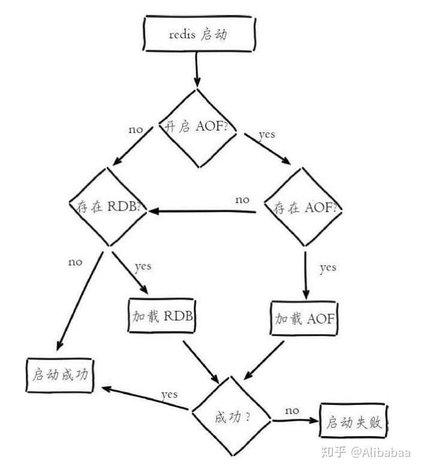

# Redis持久化知识点


### RDB持久化（保存的是二进制数据）

* 手动触发

```sh
# 主进程来生成快照文件，阻塞服务器响应其他命令
save

# 主进程fork子进程，子进程来生成快照文件，父子进程共享数据
bgsave
```

* 自动触发

1. 配置文件中 save m n，表示m秒内有n次操作，会触发bgsave
2. 主从节点，从节点执行全量复制，主节点执行bgsave，并将生成的RDB文件发送给从节点
3. 执行debug reload命令重新加载redis时，自动触发save操作
4. 执行shutdown命令时，如果没有开启AOF持久化，则自动执行bgsave

* 优点

可以生成多个数据文件，容易恢复数据

* 缺点

几分钟生成一次RDB文件，两次同步之间的数据有可能全部丢失


### AOF持久化（保存的是操作记录）

* 工作过程

客户端执行命令后，会写入到AOF_buf缓存区（减少磁盘IO），执行sync操作，写入AOF文件

* 缓存区同步到文件

```sh
# 每次命令都同步
appendfsync always

# 每秒同步一次
appendfsync everysec

# 不做处理，交给操作系统处理
appendfsync no
```

* 优点

不容易丢失数据，最多丢失1s数据

* 缺点

文件较大，恢复较慢


### 恢复过程


