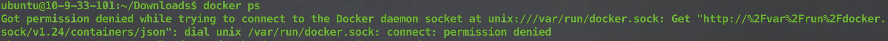

### Docker 基础


### docker.io 和 docker-ce 区别

docker.io 是 Debian 维护的
docker-ce 是 Docker 官方维护


### 安装

* Linux（Ubuntu）安装 docker.io

Linux 安装的 Docker 在 /var/lib/docker 路径下

```bash
sudo wget -qO- https://get.docker.com | sh

apt install docker.io	# 安装的不是最新版本
```

* Linux 安装 docker-ce

```bash
# 关闭 swap，注释掉 swapfile 行（如果有的话）
sudo vim /etc/fstab

# 关闭防火墙
sudo systemctl stop firewalld
sudo systemctl disable firewalld

# 关闭 selinux
sudo apt-get install selinux-utils
sudo setenforce 0
# 修改 selinux 配置文件，内容如下
/```
SELINUX=disabled
/```

# 清理 docker
sudo apt-get remove docker
sudo apt-get remove docker-ce
sudo apt-get remove docker.io

# 添加源
sudo curl -fsSL https://download.docker.com/linux/ubuntu/gpg | sudo apt-key add -
sudo add-apt-repository "deb [arch=amd64] https://download.docker.com/linux/ubuntu $(lsb_release -cs) stable"
sudo add-apt-repository "deb [arch=arm64] https://download.docker.com/linux/ubuntu $(lsb_release -cs) stable"

# 更新源
sudo apt-get update

# 查看有哪些 Docker 版本
sudo apt-cache madison docker-ce

# 安装指定版本 Docker
sudo apt-get install docker-ce=18.06.3~ce~3-0~ubuntu
# 安装最新版本 Docker
sudo apt-get install docker

# 修改 Docker 源
sudo vim /etc/docker/daemon.json
# Docker 配置
/```
{
    "registry-mirrors": ["https://registry.cn-hangzhou.aliyuncs.com"],
    "exec-opts": ["native.cgroupdriver=systemd"]
}
/```

# 启动服务
sudo systemctl daemon-reload
sudo systemctl start docker.service
sudo systemctl enable docker.service
```

* 报错问题解决

如果报权限错误，如：

```bash
# 安装的docker默认是root用户可以使用
sudo usermod -aG docker 用户名

sudo chmod 666 /var/run/docker.sock

sudo apt-get install acl

sudo setfacl --modify user::rw /var/run/docker.sock
```

* Mac下安装

在官网下载 docker Mac版安装包，直接安装

* Windows10安装

1. BIOS开启虚拟环境
2. 开启Hyper-V，控制面板-程序-程序和功能-启用或关闭Windows功能-勾选Hyper-V
3. 下载Docker安装程序, 双击安装
4. 安装完成后, Docker自动启动, 通知栏会有小鲸鱼
5. 命令行docker version查看docker版本, 使用docker run hello-world载入镜像测试

* CentOS 安装 docker-ce

```bash
yum install yum-utils

yum-config-manager --add-repo http://download.docker.com/linux/centos/docker-ce.repo

yum list docker-ce --showduplicates | sort -r

yum install docker-ce

systemctl start docker.service
systemctl enable docker.service
```


### 基础命令

* docker版本

```bash
docker version
```

* docker信息

```bash
docker info
```
