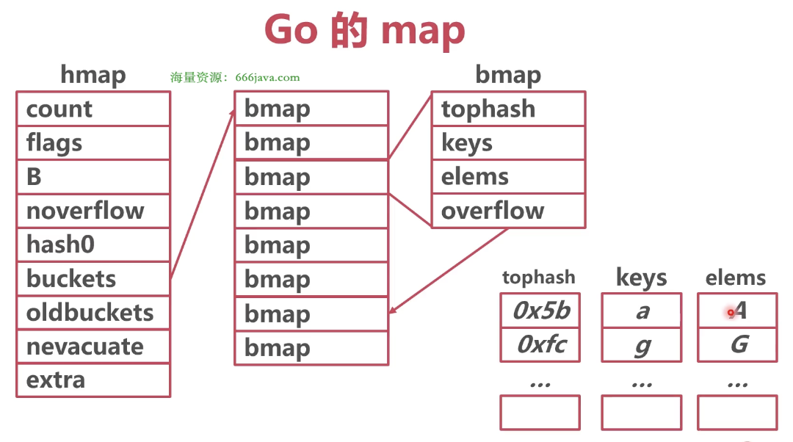
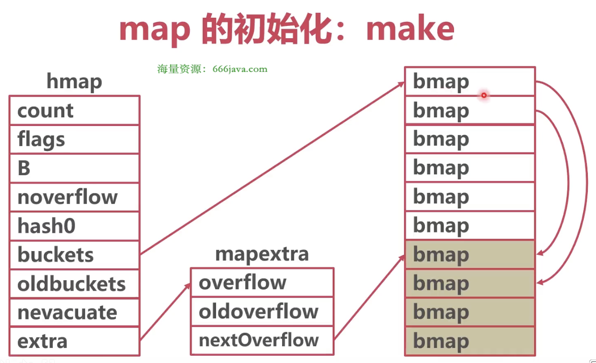

### 哈希表

* map 结构体：hmap



```go
// runtime/map.go
package runtime

type hmap struct {
	count      int            // 键值对的数量, len(map) 直接返回此值
	flags      uint8          //
	B          uint8          // 2^B = buckets
	noverflow  uint16         //
	hash0      uint32         // 哈希种子
	
	// bucket = bmap, buckets = []bmap
	buckets    unsafe.Pointer // buckets 指针指向的是由 bmap 组成的数组, array of 2^B Buckets. may be nil if count==0
	oldbuckets unsafe.Pointer // 扩容时指向原 bucket 数组
	nevacuate  uintptr        // 指示扩容进度，小于此地址的 buckets 迁移完成
	
	extra      *mapextra      //
}
```


* bucket 结构体：bmap（桶）

```go
// runtime/map.go
package runtime

const (
	bucketCntBits = 3
	bucketCnt     = 1 << bucketCntBits
)

// A bucket for a Go map.
type bmap struct {
    // 每个桶有 8 个槽
	tophash [bucketCnt]uint8 // bucketCnt：1 << 3 == 8，每个桶里可以放 8 个数据，如果超过 8 个，需要放入溢出桶里
}
```

编译期间会动态创建一个新的结构

```go
package runtime

type bmap struct {
	topbits  [8]uint8     // 哈希值的高 8 位
	keys     [8]keytype   // 键数组
	values   [8]valuetype // 值数组
	pad      uintptr      // 对齐填充
	overflow uintptr      // 溢出桶
}
```


### 哈希表创建

* make

1. makemap 创建 map 结构体



```go
package main

import "fmt"

func main() {
	m := make(map[string]int, 10)
	
	fmt.Println(m)
}
```

```bash
# 分析创建过程
go build -gcflags -S main.go
```

[map make 创建](images/map%20make%20创建.png)

```go
// runtime/map.go/makemap
package runtime

func makemap(t *maptype, hint int, h *hmap) *hmap {
	// new 一个 hmap
	if h == nil {
		h = new(hmap)
	}

	// 计算 B 值
	B := uint8(0)
	for overLoadFactor(hint, B) {
		B++
	}
	h.B = B

	// 新建桶数组，放置数据；并且创建一些溢出桶
	if h.B != 0 {
		var nextOverflow *bmap
		h.buckets, nextOverflow = makeBucketArray(t, h.B, nil)
		if nextOverflow != nil {
			h.extra = new(mapextra)
			h.extra.nextOverflow = nextOverflow
		}
	}
	
	// 设置 map 的一些值

	return h
}
```


* 字面量

1. 数据少于 25 个，转化为简单赋值（先 make 一个 map，再进行赋值）

```go
package main

import "fmt"

func main() {
	m := map[string]int{"1": 1, "2": 2, "3": 3}
	fmt.Println(m)
}
```

上面的初始化相当于：

```go
package main

import "fmt"

func main() {
	m := make(map[string]int, 3)
	m["1"] = 1
	m["2"] = 2
	m["3"] = 3
}
```

```bash
# 分析创建过程
go build -gcflags -S main.go
```

[map 字面量创建](images/map字面量创建.png)


2. 数据多于 25 个，转化为循环赋值

```go
package main

import "fmt"

func main() {
	m := map[string]int{
		"1": 1,
		"2": 2,
		"3": 3,
	    ...
		"26": 26
	}
	fmt.Println(m)
}
```

上面的初始化相当于

```go
package main

import "fmt"

func main() {
	m := make(map[string]string, 26)

	kList := []string{"1", "2", "...", "26"}
	vList := []string{"1", "2", "...", "26"}

	for i := 0; i < len(kList); i++ {
		m[kList[i]] = vList[i]
	}
	
	fmt.Println(m)
}
```

```bash
# 分析创建过程
go build -gcflags -S main.go
```

[map 字面量创建](images/map%20字面量创建2.png)


### 访问

通过哈希函数计算哈希值，低 B 位确定桶号，高 8 为确定桶中槽号

1. 计算桶号：将 key 和 hash0 放入哈希函数，计算出哈希值，哈希值二进制低 B 位值确定 bucket（如 B = 3，共有 8 个桶，则取哈希值二进制低 3 位，可以表示 0 - 7 号桶）
2. 计算 tophash：哈希值二进制高 8 位，去 bmap 的 tophash 数组里去找对应的 tophash 值（可能去溢出桶里找），找到 tophash 值后，比较 key，如果 key 相同，返回 value
3. 如果没找到，并且有溢出桶，需要去溢出桶里面去找
4. 如果都没找打，说明 key 不存在


### 写入

过程和访问相同，如果找到记录，修改 value 的值；如果没找到记录，则添加一条记录


### 扩容

* 为什么需要扩容

哈希碰撞严重，每个 bucket 的溢出桶过多，多个溢出桶[退化为链表](images/哈希碰撞.png)，导致严重的性能下降


* 扩容触发时机：插入数据（mapassign，assign：分配）

```go
// runtime/map.go/mapassign
package runtime

// Like mapaccess, but allocates a slot for the key if it is not present in the map.
func mapassign(t *maptype, h *hmap, key unsafe.Pointer) unsafe.Pointer {
	// 扩容时机：如果没有在扩容 && 装载系数超过范围 || 溢出桶数量超过范围
	if !h.growing() && (overLoadFactor(h.count+1, h.B) || tooManyOverflowBuckets(h.noverflow, h.B)) {
		hashGrow(t, h)
		goto again // Growing the table invalidates everything, so try again
	}
}
```

1. 装载系数（平均每个哈希槽放入多少个 key）超过 6.5（平均每个槽 6.5 个 key）
2. 使用了太多溢出桶（溢出桶超过了普通桶）


* 扩容类型

1. 等量扩容：数据不多但是溢出桶太多（曾经溢出桶有很多数据，后来被删除，溢出桶数据稀疏，也就是整理数据）
2. 翻倍扩容：数据太多，增加普通桶的数量


* 扩容步骤

step 1

1. 创建一组新桶（等量扩容时，新 buckets 容量和以前相等，翻倍扩容时，hmap 中 B 加 1，buckets 容量是以前的 2 倍）
2. oldbuckets 指向原有的桶数组
3. buckets 指向新的桶数组
4. flags 标记为扩容状态

```go
// runtime/map.go/hashGrow
package runtime

func hashGrow(t *maptype, h *hmap) {
	// 计算新的需要的桶数量
	bigger := uint8(1)
	if !overLoadFactor(h.count+1, h.B) {
		bigger = 0
		h.flags |= sameSizeGrow
	}
	
	// 将原 buckets 赋值给 oldbuckets
	oldbuckets := h.buckets
	
	// 创建一组新桶
	newbuckets, nextOverflow := makeBucketArray(t, h.B+bigger, nil)

	// 新状态
	flags := h.flags &^ (iterator | oldIterator)
	if h.flags&iterator != 0 {
		flags |= oldIterator
	}
	
	// 标记为扩容状态
	h.flags = flags
	h.oldbuckets = oldbuckets
	h.buckets = newbuckets

	// 更新溢出桶的信息，因为以前的桶已经变成老桶，所以溢出桶信息也要更新
	if h.extra != nil && h.extra.overflow != nil {
		// Promote current overflow buckets to the old generation.
		if h.extra.oldoverflow != nil {
			throw("oldoverflow is not nil")
		}
		h.extra.oldoverflow = h.extra.overflow
		h.extra.overflow = nil
	}
	if nextOverflow != nil {
		if h.extra == nil {
			h.extra = new(mapextra)
		}
		h.extra.nextOverflow = nextOverflow
	}

	// the actual copying of the hash table data is done incrementally
	// by growWork() and evacuate().
}
```

step 2

1. 将所有数据从旧桶驱逐到新桶
2. 采用渐进式驱逐
3. 每次操作一个旧桶时，将旧桶数据驱逐到新桶
4. 读取时不进行驱逐，只判断读取新桶还是旧桶

```go
// runtime/map.go/growWork
package runtime

func growWork(t *maptype, h *hmap, bucket uintptr) {
	// 数据驱逐
	evacuate(t, h, bucket&h.oldbucketmask())
}
```

step 3

1. 所有旧桶驱逐完成后
2. oldbuckets 回收
