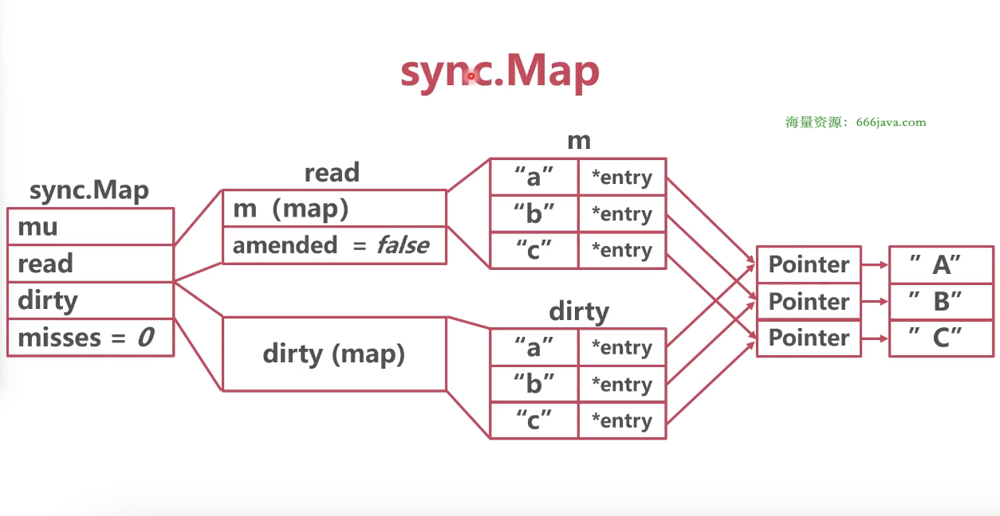
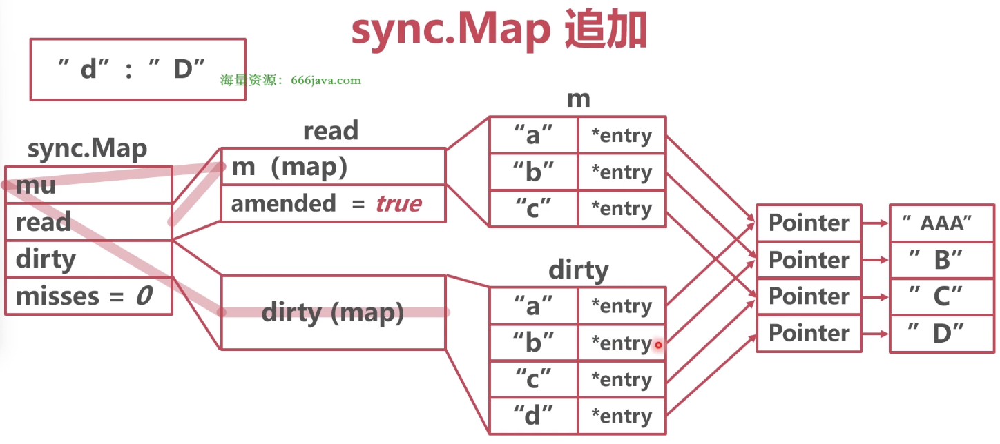
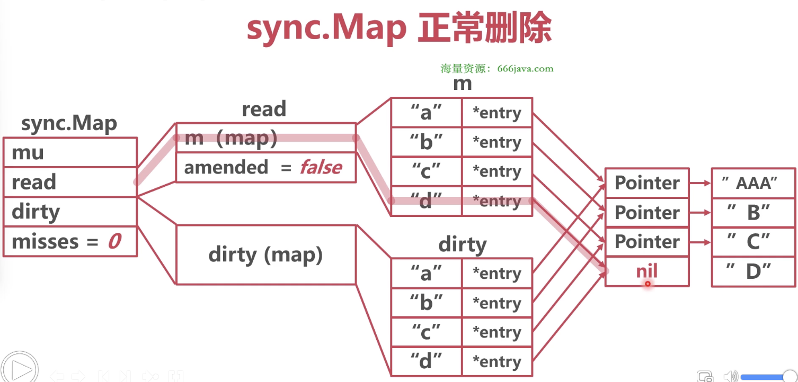
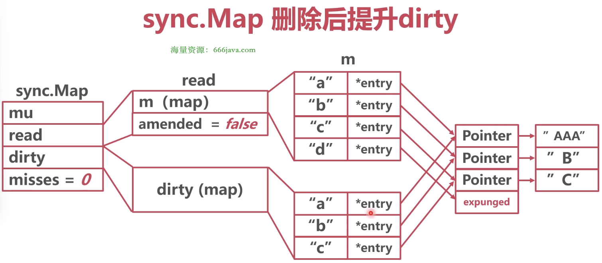

### 并发问题

A 协程在桶中读取数据时（读取的老桶数据），B 协程驱逐了这个桶，A 协程会读取到错误的数据或者找不到数据


### 解决

* 给 map 加锁（mutex）

* 原生并发 map：sync.Map


### sync.Map



* 结构体

```go
// sync/map.go/Map
package sync

type Map struct {
	mu     Mutex        // 锁 dirty
	read   atomic.Value // readOnly 结构体
	dirty  map[interface{}]*entry
	misses int          // 是否命中
}

type readOnly struct {
	m       map[interface{}]*entry
	amended bool // 追加字段，true if the dirty map contains some key not in m.
}

type entry struct {
	p unsafe.Pointer // 指向 map 实际的值
}
```


### 正常读写

检查 Map 的 read 中是否存在读写的键
发现存在，在 m 的 map 中去寻找键值对 -> entry -> 实际值的指针，进行读写


### 追加（涉及扩容，加锁）

检查 Map 的 read 中是否存在追加的键
发现不存在，给 Map 的 mu 加锁，锁 Map 的 dirty
生成新 entry，挂在 dirty 上，Map 的 read 的 amended 设置为 true




### 追加后读写（不涉及到扩容）

* 读写

检查 Map 的 read 中是否存在读写的键
发现不存在，检查 Map 的 read 的 amended 字段，为 true，去 dirty 里面读
在 dirty 中读取后，将 Map 的 misses 加 1

* Dirty 提升

当 misses 值足够大（等于 dirty 的长度），将 dirty 提升，替换 read，dirty 变为 nil
将 Map 的 read 的 amended 设置为 false
将 Map 的 misses 设置为 0
后续如果有追加的动作，再重建 dirty


### 删除

* 正常删除

检查 Map 的 read 中是否存在删除的键
发现存在，在 m 的 map 中去寻找键值对 -> entry -> 将键对应的 entry 的指针置为 nil
GC 会回收 m 中的键



* 追加后删除

在 dirty 中寻找到 entry 后，将键对应的 entry 的指针置为 nil
当 dirty 提升时，将键对应的 entry 指针设置为 expunged（删除），重建 dirty 时，不重建此键


