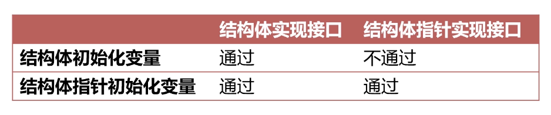

### 接口

* 接口值的底层表示

```go
// runtime/runtime2.go/iface
package runtime

type iface struct {
	tab  *itab          // 记录接口类型信息和实现的方法
	data unsafe.Pointer // 记录数据的地址
}

type itab struct {
	inter *interfacetype    // 接口的类型
	_type *_type            // 接口装载的值类型
	hash  uint32
	_     [4]byte
	fun   [1]uintptr        // 值类型实现的方法，可变长，在编译运行时变长
}
```


### 类型断言

* 定义

类型断言是一个使用在接口值上的操作

* 作用

1. 可以将接口值转换为其他类型值（实现或兼容接口）

```go
package main

import "fmt"

type Car interface {
	Drive()
}

type TrafficTool interface {
	Drive()
}

type Truck struct {
	Model string
}

func (t Truck) Drive() {
	fmt.Println("truck driving")
}

func main() {
	var c Car = Truck{}
	t1 := c.(Truck)       // 转为结构体
	t2 := c.(TrafficTool) // 转为接口
	fmt.Println(t1, t2)
}
```

2. 可以配合 switch 进行类型判断

```go
package main

import "fmt"

type Car interface {
	Drive()
}

type Truck struct {
	Model string
}

func (t Truck) Drive() {
	fmt.Println("truck driving")
}

func main() {
	var c Car = Truck{}
	switch c.(type) {
	case Truck:
		fmt.Println("t")
	}
}
```


### 结构体和指针实现接口



* 结构体实现接口

```go
package main

import "fmt"

type Car interface {
	Drive()
}

type Truck struct {
	Model string
}

/**
    使用结构体实现
 */
func (t Truck) Drive() {
	fmt.Println(t.Model)
}

func main() {
	// 下面这两种都可以
	var c1 Car = Truck{}
	var c2 Car = &Truck{}
	fmt.Println(c1, c2)
}
```

2. 结构体指针实现接口

```go
package main

import "fmt"

type Car interface {
	Drive()
}

type Truck struct {
	Model string
}

func (t *Truck) Drive() {
	fmt.Println(t.Model)
}

func main() {
	// 这种方法可以实现
	var c2 Car = &Truck{}
	// 这种方法不行
	var c1 Car = Truck{}
	fmt.Println(c1, c2)
}
```


### 空接口

* 空接口结构体

```go
// runtime/runtime2.go/eface
package runtime

type eface struct {
	_type *_type
	data  unsafe.Pointer
}
```

当 _type 和 data 均不存在时，才是 nil 接口

* 作用

空接口值可以承载任何数据，作为任意类型的函数入参

函数调用时，会生成一个 eface，再传参

```go
package fmt

func Println(a ...interface{}) (n int, err error) {
	return Fprintln(os.Stdout, a...)
}
```
