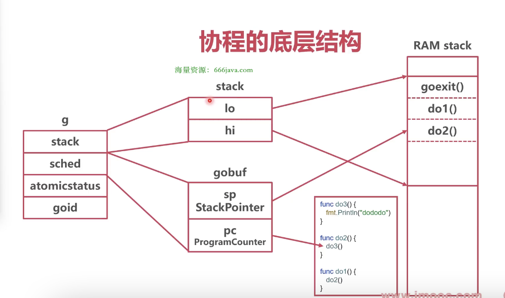

### 线程

* 线程问题

1. 线程本身占用资源大
2. 线程的操作开销大
3. 线程切换开销大


### 协程

* 工作原理

协程将一段程序的运行状态打包，可以在线程之间调度


* 协程结构体（runtime/runtime2.go/g）



```go
package runtime

// 协程栈
type stack struct {
	lo uintptr
	hi uintptr
}

type g struct {
	stack       stack   // 协程栈

	m            *m     // current m; offset known to arm liblink
	sched        gobuf  // 协程运行现场
	
	atomicstatus uint32 // 协程状态
	
	goid         int64  // 协程 ID
}

// 协程运行现场
type gobuf struct {
	sp   uintptr // stack pointer，栈指针
	pc   uintptr // program counter，程序计数器
}
```


* 线程抽象结构体（runtime/runtime2.go/m）

```go
package runtime

type m struct {
	g0      *g      // 用来调度其他协程的协程，操作调度器

	curg    *g      // 当前线程正在运行的协程
	
	id      int64   // 线程 ID

	mOS             // 记录每种操作系统，对线程额外的描述信息
}
```
