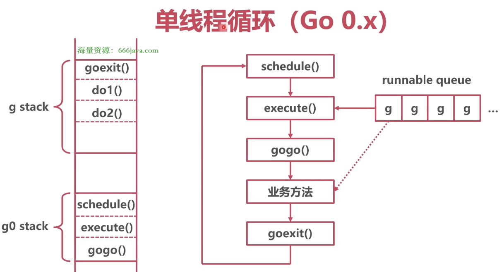

### 流程



schedule() -> execute() -> gogo() -> 业务方法 -> goexit()


### g0 stack

* schedule

```go
// runtime/proc.go/schedule
package runtime

// One round of scheduler: find a runnable goroutine and execute it.
// Never returns.
func schedule() {
	// 选择一个协程 g
	
	execute(g)
}
```

* execute

```go
// runtime/proc.go/execute
package runtime

func execute(g) {
	gogo(g.sched)
}
```

* gogo（汇编实现：runtime/asm_amd64.s/runtime·gogo）

```go
// runtime/stubs.go/gogo
package runtime

func gogo(buf *gobuf)
```

```assembly
TEXT runtime·gogo(SB), NOSPLIT, $16-8
    MOVQ	gobuf_sp(BX), SP	// restore SP

    // 恢复 PC 指针，跳转到协程的业务逻辑
	MOVQ	gobuf_pc(BX), BX
	JMP	BX
```

在 runtime·gogo 汇编中插入 goexit 栈帧，切换 PC 到 协程的 sched.pc


### g stack

* 业务方法

* goexit（汇编实现：runtime/asm_amd64.s/runtime·goexit）

执行完业务方法，退回到在 gogo 方法中插入的栈帧 goexit，在汇编中调用 runtime·goexit1

```go
// runtime/stubs.go/goexit
package runtime

func goexit(neverCallThisFunction)
```

```assembly
TEXT runtime·goexit<ABIInternal>(SB),NOSPLIT,$0-0
    
    // 调用 goexit1
	CALL	runtime·goexit1(SB)	// does not return
```

```go
// runtime/proc.go/goexit1
package runtime

func goexit1() {
	mcall(goexit0)
}

// goexit continuation on g0.
func goexit0(gp *g) {
	schedule()
}
```

```go
// runtime/stubs.go/mcall
package runtime

// mcall switches from the g to the g0 stack and invokes fn(g)
// mcall 切换 'g 协程栈' 到 'g0 协程栈'，并且调用 fn 方法
func mcall(fn func(*g))
```
