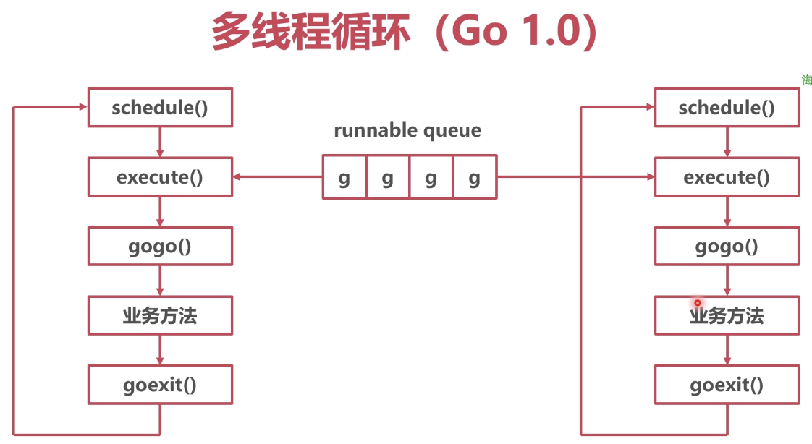
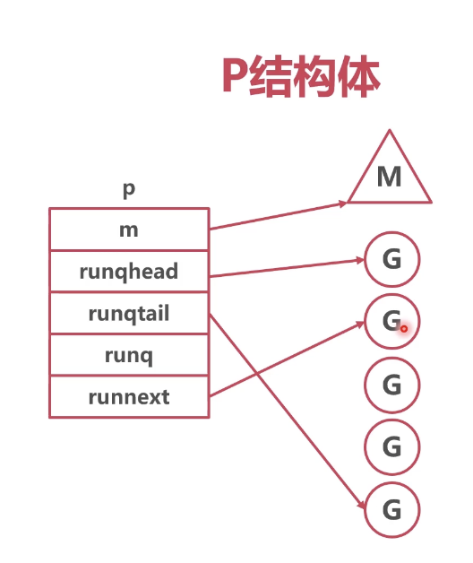

### 协程全局队列



* 问题

所有的线程 M 去全局队列抓取协程 G，有并发问题


* 解决

给全局队列加锁


### 协程本地队列

* 解决

使用本地队列，每次去全局队列拿一批 G 协程


* 队列抽象结构体



```go
// runtime/runtime2.go/p
package runtime

type p struct {
	m           muintptr   // m 的 指针，指向提供服务的线程

	mcache      *mcache    // 本地内存索引，每个 mcache 为 136 种 mspan，详细见 009_mem_gc
	pcache      pageCache

	// Queue of runnable goroutines. Accessed without lock.
	runqhead uint32         // 队列头
	runqtail uint32         // 队列尾
	runq     [256]guintptr  // 协程队列

	runnext guintptr        // 下一个可用协程指针

	preempt                    bool // 是否被抢占
}
```

* 协程选择过程

```go
// runtime/proc.go/schedule
package runtime

func schedule() {
    var gp *g
    
    // 从本地队列获取协程
 	if gp == nil {
		gp, inheritTime = runqget(p)
	}
	
	// 本地队列未找到协程，从全局队列里找
	if gp == nil {
		gp, inheritTime = findrunnable() // blocks until work is available
	}
}

// 从本地队列获取
func runqget(_p_ *p) (gp *g, inheritTime bool) {
    // 下一个要执行的协程
	next := _p_.runnext
	if _p_.runnext.cas(next, 0) {
		return next.ptr(), true
	}
}

func findrunnable() (gp *g, inheritTime bool) {
    // 再次尝试从本地队列获取
	if gp, inheritTime := runqget(_p_); gp != nil {
		return gp, inheritTime
	}
	
	// 从全局队列获取
	if sched.runqsize != 0 {
		lock(&sched.lock)
		gp := globrunqget(_p_, 0)
		unlock(&sched.lock)
		if gp != nil {
			return gp, false
		}
	}

	// 从其他协程偷协程
	if gp := runqsteal(_p_, p2, stealTimersOrRunNextG); gp != nil {
        return gp, false
    }
}

// Try get a batch of G's from the global runnable queue.
// sched.lock must be held.
// 从全局队列获取一批协程
func globrunqget(_p_ *p, max int32) *g {
	
}

// 从其他协程偷协程
// Steal half of elements from local runnable queue of p2
// and put onto local runnable queue of p.
// Returns one of the stolen elements (or nil if failed).
func runqsteal(_p_, p2 *p, stealRunNextG bool) *g {
	
}
```


* 作用

1. M 与 G 之间的中介
2. P 持有一些 G，使得每次获取 G 的时候不用从全局找
3. 减少了并发冲突的情况


### 新建协程

随机选择一个 P，将新协程放入 P 的 runnext（插队），若 P 本地队列满，放入全局队列

```go
// runtime/proc.go/newproc
package runtime

func newproc(siz int32, fn *funcval) {
	newg := newproc1(fn, argp, siz, gp, pc)

	_p_ := getg().m.p.ptr()
	runqput(_p_, newg, true)
}

// 新建协程
func newproc1(fn *funcval, argp unsafe.Pointer, narg int32, callergp *g, callerpc uintptr) *g {
	
}

// 放入队列
// runqput tries to put g on the local runnable queue.
// If next is false, runqput adds g to the tail of the runnable queue.
// If next is true, runqput puts g in the _p_.runnext slot.
// If the run queue is full, runnext puts g on the global queue.
// Executed only by the owner P.
func runqput(_p_ *p, gp *g, next bool) {
	
}
```
