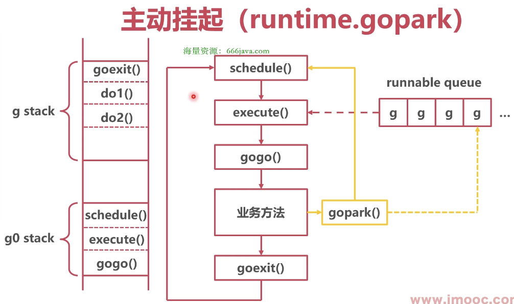

### 问题

协程顺序执行，无法并发，如果协程特别大，导致其他协程饥饿


### 本地队列 Goroutine 饥饿

* 解决

本地队列 Goroutine 切换

* 切换时机

1. 主动挂起



业务方法调用 gopark 后，gopark() 会直接跳转到 schedule()

流程：schedule() -> execute() -> gogo() -> 业务方法（隐式调用 gopark()）-> 保存现场 -> schedule()

```go
// runtime/proc.go/gopark
package runtime

// Puts the current goroutine into a waiting state and calls unlockf on the system stack
func gopark(unlockf func(*g, unsafe.Pointer) bool, lock unsafe.Pointer, reason waitReason, traceEv byte, traceskip int) {
	// 切换到 g0 栈，并且调用 schedule()
	mcall(park_m)
}

// park continuation on g0.
func park_m(gp *g) {
	schedule()
}
```

```go
// runtime/stubs.go/mcall
package runtime

// mcall switches from the g to the g0 stack and invokes fn(g)
// mcall 切换 'g 协程栈' 到 'g0 协程栈'，并且调用 fn 方法
func mcall(fn func())
```

注意⚠️：
业务逻辑不能直接调用 gopark()，是 Go 通过一些方法去调用，比如在 time.Sleep() 时会调用 gopark()
gopark() 调用后，协程变成**等待状态**，系统会把协程状态改为**可运行状态**

2. 系统调用完成时


流程：schedule() -> execute() -> gogo() -> 业务方法 -> entrysyscall() -> 系统调用 -> exitsyscall() -> 保存现场 -> schedule()

```go
// runtime/proc.go/exitsyscall
package runtime

func exitsyscall() {
    if sched.disable.user && !schedEnabled(_g_) {
        // Scheduling of this goroutine is disabled.
        Gosched()
    }
}

func Gosched() {
	mcall(gosched_m)
}

// Gosched continuation on g0.
func gosched_m(gp *g) {
	goschedImpl(gp)
}

func goschedImpl(gp *g) {
	schedule()
}
```

```go
// runtime/stubs.go/mcall
package runtime

// mcall switches from the g to the g0 stack and invokes fn(g)
// mcall 切换 'g 协程栈' 到 'g0 协程栈'，并且调用 fn 方法
func mcall(fn func())
```


### 全局队列 Goroutine 饥饿

* 解决

每 61 次去全局队列中获取 1 个 Goroutine

```go
// runtime/proc.go/schedule
package runtime

func schedule() {
	if gp == nil {
		// 每 61 次去全局队列中获取 1 个 goroutine
		if _g_.m.p.ptr().schedtick%61 == 0 && sched.runqsize > 0 {
			lock(&sched.lock)
			gp = globrunqget(_g_.m.p.ptr(), 1)
			unlock(&sched.lock)
		}
	}
}
```
