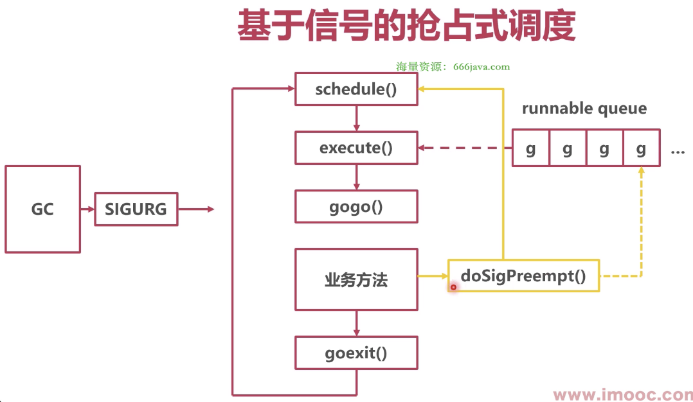

### 抢占式调度

* 协程切换问题

如果一个协程永远不主动挂起，永远不系统调用，那么协程永远不会被切换，怎么办？


* morestack（汇编实现，runtime/asm_amd64.s/runtime·morestack）

```go
// runtime/stubs.go/morestack
package runtime

func morestack()
```

```assembly
TEXT runtime·morestack(SB),NOSPLIT,$0-0
    // 调用 newstack
    CALL	runtime·newstack(SB)
```

一个方法在调用另一个方法前，编译器会插入 runtime.morestack()


* morestack 方法的作用

在函数跳转前，检查协程栈空间是否充足，不够的话会扩大栈空间


### 基于协作的抢占式调度


* 标记抢占

标记：系统监控到 Goroutine 运行超过 10 ms，被认为是大协程，会造成其他协程饥饿，将 g.stackguard0 置为 0xfffffade（抢占标志）

抢占：当协程执行 morestack() 时判断是否被抢占，如果被抢占，回到 schedule()


* 调用

在汇编 morestack 中，会调用 runtime·newstack

```go
// runtime/stack.go/newstack
package runtime

const (
	uintptrMask = 1<<(8*sys.PtrSize) - 1
	stackPreempt = uintptrMask & -1314
)

func newstack() {
	// 判断是否被抢占
	preempt := atomic.Loaduintptr(&gp.stackguard0) == stackPreempt
	
	// 抢占
	if preempt {
		gopreempt_m(gp)
	}
}
```

```go
// runtime/stubs.go
package runtime

func gopreempt_m(gp *g) {
	goschedImpl(gp)
}

func goschedImpl(gp *g) {
	schedule()
}
```


### 基于信号的抢占式调度



* 问题

如果永远不调用 morestack()，怎么办？


* 信号抢占

信号：指**线程信号**，操作系统中，有很多基于信号的底层通信方式

1. 注册 SIGURG 信号（紧急信号）的处理函数
2. GC 工作时（GC时，很多线程停止，适合发送信号），向目标线程发送信号
3. 正在执行协程的线程收到信号，立即停止，触发调度


* 调用

```go
// runtime/signal_unix.go/doSigPreempt
package runtime

// doSigPreempt handles a preemption signal on gp.
func doSigPreempt(gp *g, ctxt *sigctxt) {
	ctxt.pushCall(funcPC(asyncPreempt), newpc)
}
```

```go
package runtime

// asyncPreempt saves all user registers and calls asyncPreempt2.
func asyncPreempt()
```

asyncPreempt 为汇编实现，会调用 asyncPreempt2

```assembly
TEXT ·asyncPreempt<ABIInternal>(SB),NOSPLIT|NOFRAME,$0-0
	CALL ·asyncPreempt2(SB)
```

```go
// runtime/preempt.go/asyncPreempt2
package runtime

func asyncPreempt2() {
	mcall(preemptPark)
}

func preemptPark() {
	schedule()
}
```

```go
// runtime/stubs.go/mcall
package runtime

// mcall switches from the g to the g0 stack and invokes fn(g)
// mcall 切换 'g 协程栈' 到 'g0 协程栈'，并且调用 fn 方法
func mcall(fn func())
```
