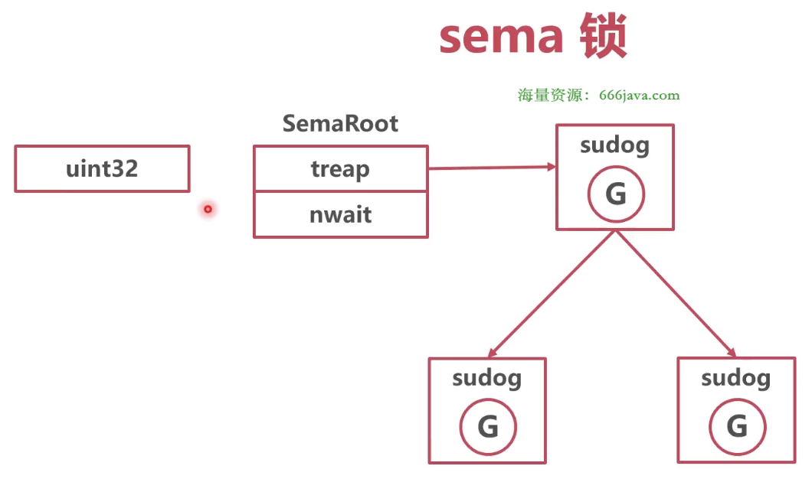

### Sema

也叫信号量锁/信号锁，本质是一个 uint32 值，含义是同时可并发的数量

* 结构体



每一个 sema 锁对应一个 SemaRoot 结构体，SemaRoot 中有一个平衡二叉树用于协程排队

```go
// runtime/sema.go/semaRoot
package runtime

type semaRoot struct {
	lock  mutex
	// 挂的等待协程的平衡二叉树
	treap *sudog // root of balanced tree of unique waiters.
	nwait uint32 // Number of waiters. Read w/o the lock.
}
```

```go
// runtime/runtime2/mutex
package runtime

type mutex struct {
	lockRankStruct
	key uintptr
}
```

```go
// runtime/runtime2.go/sudog
package runtime

type sudog struct {
	g *g

	next *sudog
	prev *sudog
}
```

* 作用

sema 经常被用作休眠队列（）


### 获取、释放锁

* 获取锁

```go
// runtime/sema.go/semacquire
package runtime

// Called from runtime.
func semacquire(addr *uint32) {
	semacquire1(addr, false, 0, 0)
}

func semacquire1(addr *uint32, lifo bool, profile semaProfileFlags, skipframes int) {
	// 获取到锁
	if cansemacquire(addr) {
		return
	}
	
	// 没有获取到锁
	// 将 nwait 加 1
    atomic.Xadd(&root.nwait, 1)
    // Any semrelease after the cansemacquire knows we're waiting
    // (we set nwait above), so go to sleep.
    // 将协程放入平衡二叉树，然后将协程睡眠
    root.queue(addr, s, lifo)
    goparkunlock(&root.lock, waitReasonSemacquire, traceEvGoBlockSync, 4+skipframes)
}

func cansemacquire(addr *uint32) bool {
	for {
		v := atomic.Load(addr)
		// 等于 0，直接返回 false
		if v == 0 {
			return false
		}
		// 将信号量减 1，返回 true
		if atomic.Cas(addr, v, v-1) {
			return true
		}
	}
}
```


* 释放锁

```go
// runtime/sema.go/semrelease
package runtime

func semrelease(addr *uint32) {
	semrelease1(addr, false, 0)
}

func semrelease1(addr *uint32, handoff bool, skipframes int) {
	// 信号量加 1
    atomic.Xadd(addr, 1)
    
    // nwait = 0，没有协程在等待，直接返回
    if atomic.Load(&root.nwait) == 0 {
		return
	}
	
	// 有协程在等待，将协程出队
    s, t0 := root.dequeue(addr)
	if s != nil {
		// 将 nwait 减 1
		atomic.Xadd(&root.nwait, -1)
	}
}
```
