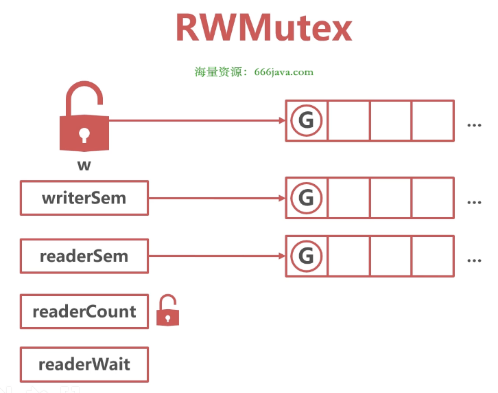

# RWMutex 读写锁


### 读写锁

* 读写锁需求

1. 每个锁分为读锁和写锁，写锁互斥
2. 没有加写锁时，多个协程都可以加读锁
3. 加了写锁时，无法加读锁，读协程排队等待
4. 加了读锁，写锁排队等待


### 结构体



```go
// sync/rwmutex.go/RWMutex
package sync

type RWMutex struct {
	w           Mutex  // held if there are pending writers，互斥锁作为写锁
	writerSem   uint32 // semaphore for writers to wait for completing readers，写协程队列
	readerSem   uint32 // semaphore for readers to wait for completing writers，读协程队列
	readerCount int32  // 加读锁的协程数量，正值：正在读的协程数量，负值：加了写锁
	readerWait  int32  // number of departing readers，写锁生效之前要等待多少读锁释放
}
```


### 加写锁

* 没有读协程

在加写锁之前没有协程在读，此时 readerCount 为 0，readerWait 为 0

加锁过程：
1. 加 mutex 锁
2. 并且将 readerCount 置为 rwmutexMaxReaders


* 有读协程

在加写锁之前有 3 个协程在读，此时 readerCount 为 3，readerWait 为 0

加锁过程：
1. 加 mutex 锁
2. 将 readerCount 置为 3 - rwmutexMaxReaders
3. readerWait 置为 3，将写协程加入 writerSem 队列

```go
// sync/rwmutex.go/Lock
package sync

func (rw *RWMutex) Lock() {
    // First, resolve competition with other writers.
	rw.w.Lock()
	
	// 将 readerCount 减 rwmutexMaxReaders
    r := atomic.AddInt32(&rw.readerCount, -rwmutexMaxReaders) + rwmutexMaxReaders
    
    // 存在读协程，写协程进入 sema 队列休眠
    if r != 0 && atomic.AddInt32(&rw.readerWait, r) != 0 {
		runtime_SemacquireMutex(&rw.writerSem, false, 0)
	}
}
```


### 解写锁

在解写锁之前有 2 个读协程在 readerSem 队列，此时 readerCount 为 2 - rwmutexMaxReaders，readerWait 为 0

解锁过程：
1. 将 readerCount 加 rwmutexMaxReaders
2. 释放在 readerSem 中等待的读协程
3. 释放 mutex 锁

```go
// sync/rwmutex.go/Unlock
package sync

func (rw *RWMutex) Unlock() {
	// readerCount 加 rwmutexMaxReaders
    r := atomic.AddInt32(&rw.readerCount, rwmutexMaxReaders)
    
    // Unblock blocked readers, if any.
	for i := 0; i < int(r); i++ {
		runtime_Semrelease(&rw.readerSem, false, 0)
	}

    // Allow other writers to proceed.
	rw.w.Unlock()
}
```


### 加读锁

* 无写锁（readerCount > 0）

在加读锁之前，有 2 个协程在读，此时 readerCount 为 2

加锁过程：
1. 将 readerCount 加 1，变为 3


* 有写锁（readerCount < 0）

在加读锁之前，有写锁存在，假如此时有 2 个读协程，此时 readerCount 为 2 - rwmutexMaxReaders

加锁过程：
1. 将 readerCount 加 1，变为 3 - rwmutexMaxReaders
2. 将协程放入 readerSem 队列

```go
// sync/rwmutex.go/RLock
package sync

func (rw *RWMutex) RLock() {
    // readerCount 加 1
	if atomic.AddInt32(&rw.readerCount, 1) < 0 {
		// A writer is pending, wait for it.
		// 加读协程加入 readerSem 队列
		runtime_SemacquireMutex(&rw.readerSem, false, 0)
	}
}
```


### 解读锁

* 无写锁（readerCount > 0）

在解读锁前，有 3 个协程在读，此时 readerCount 为 3

解锁过程：
1. 将 readerCount 减 1，变为 2


* 有写锁（readerCount < 0）

在解读锁之前，有写锁存在，假如此时有 3 个读协程，此时 readerCount 为 3 - rwmutexMaxReaders，readerWait 为 3

解锁过程：
1. 将 readerCount 减 1，变为 2 - rwmutexMaxReaders
2. 将 readerWait 减 1，变为 2
3. 将**写协程**释放

```go
// sync/rwmutex.go/RUnlock

func (rw *RWMutex) RUnlock() {
	// 将 readerCount 减 1
	if r := atomic.AddInt32(&rw.readerCount, -1); r < 0 {
		rw.rUnlockSlow(r)
	}
}

func (rw *RWMutex) rUnlockSlow(r int32) {
	// 将 readerWait 减 1
	if atomic.AddInt32(&rw.readerWait, -1) == 0 {
        // The last reader unblocks the writer.
		// 释放写协程
		runtime_Semrelease(&rw.writerSem, false, 1)
	}
}
```


### 读写锁使用经验

1. RW锁适合读多写少场景，减少锁冲突
