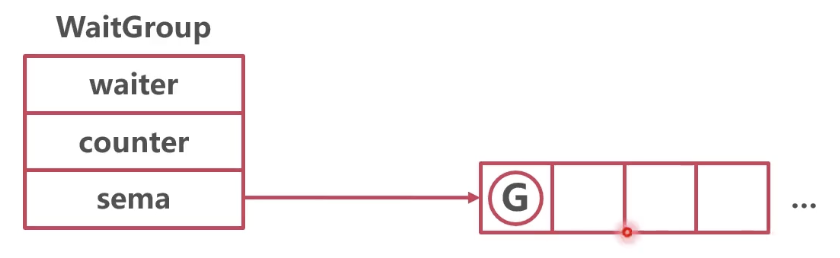

### 作用

一个（组）协程需要等待另一组协程完成


### 结构



waiter：有多少协程在等待运行
counter：有多少协程正在运行（被等待的协程）
sema：正待等待协程队列

* 结构体

```go
// sync/waitgroup.go/WaitGroup
package sync

type WaitGroup struct {
	noCopy noCopy

	// 64-bit value: high 32 bits are counter, low 32 bits are waiter count.
	// 64-bit atomic operations require 64-bit alignment, but 32-bit
	// compilers do not ensure it. So we allocate 12 bytes and then use
	// the aligned 8 bytes in them as state, and the other 4 as storage
	// for the sema.
	state1 [3]uint32
}
```


### 源码

* wait

1. 如果没有被等待的协程，直接返回
2. 否则，waiter 加 1，陷入 sema

```go
// sync/waitgroup.go/Wait
package sync

func (wg *WaitGroup) Wait() {
    // 获取 counter、waiter、sema
	// statep：counter + waiter，semap：sema
    statep, semap := wg.state()
    
    // 再次解析 waiter 和 counter
    state := atomic.LoadUint64(statep)
    v := int32(state >> 32) // counter
    w := uint32(state)      // waiter
    
    // Counter is 0, no need to wait.
    if v == 0 {
        return
    }
    
    // waiter 加 1
    if atomic.CompareAndSwapUint64(statep, state, state+1) {
    	// 将自己放入 sema 队列
        runtime_Semacquire(semap)
    }
}
```

* done

被等待协程做完，给 counter 减 1

```go
// sync/waitgroup.go/Done
package sync

// Done decrements the WaitGroup counter by one.
func (wg *WaitGroup) Done() {
	wg.Add(-1)
}
```

* add


```go
// sync/waitgroup.go/Add
package sync

func (wg *WaitGroup) Add(delta int) {
	// 给 counter 加对应的数值
    state := atomic.AddUint64(statep, uint64(delta)<<32)
    
    // 将 waiter 释放
    // Reset waiters count to 0.
	*statep = 0
    for ; w != 0; w-- {
		runtime_Semrelease(semap, false, 0)
	}
}
```
