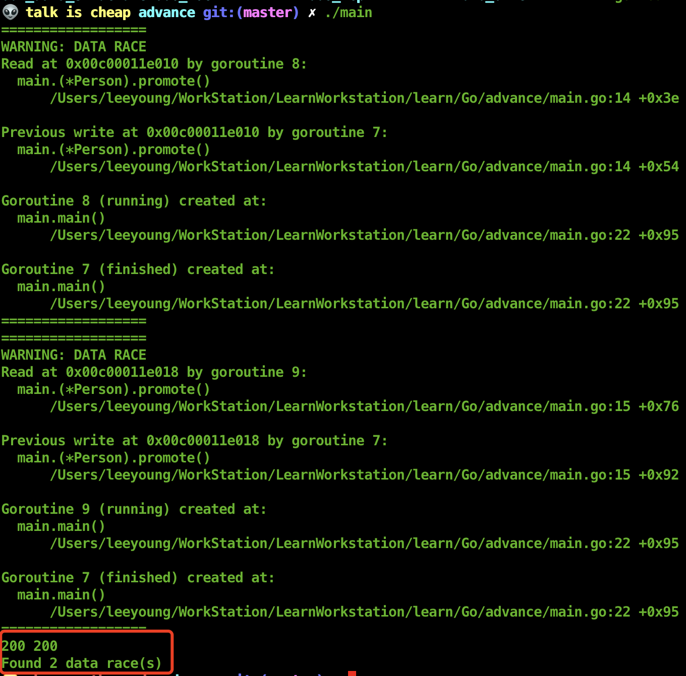

### 锁拷贝问题

* 锁拷贝问题

```go
package main

import "sync"

// 执行报错：fatal error: all goroutines are asleep - deadlock!
func main() {
	m := sync.Mutex{}
	
	m.Lock()
	n := m // 这里进行了锁拷贝
	m.Unlock()

	n.Lock()
}
```

* 检查

使用 vet 工具检测锁拷贝问题

```bash
go vet main.go
# ./main.go:19:7: assignment copies lock value to n: sync.Mutex
```


### RACE 竞争检测

* RACE 作用

发现隐含的数据竞争问题

* 有并发问题的代码

```go
package main

import (
	"fmt"
	"time"
)

type Person struct {
	salary int
	level  int
}

func (p *Person) promote() {
	p.salary += 1
	p.level += 1
}

func main() {
	p := Person{salary: 0, level: 0}

	for i := 0; i < 200; i++ {
		go p.promote()
	}

	time.Sleep(time.Second * 5)
	fmt.Println(p.salary, p.level)
}
```

* 检查

```bash
go build -race main.go

./main
```




### 死锁

[死锁检测工具](https://github.com/sasha-s/go-deadlock)
