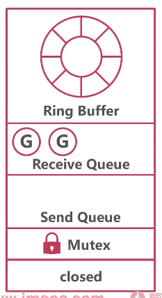
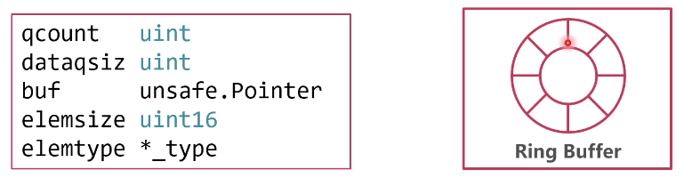
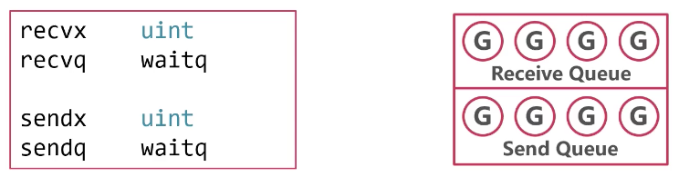

### channel 结构



* 结构体

分为 3 部分：

1. 环形缓存区
2. 发送、接收队列
3. 互斥锁

```go
// runtime/chan.go/hchan
package runtime

type hchan struct {
	// 1. 环形缓存区：环形缓存可以大幅降低 GC 的开销
	qcount   uint           // total data in the queue，缓存区数据个数
	dataqsiz uint           // size of the circular queue，缓存区大小
	buf      unsafe.Pointer // points to an array of dataqsiz elements，缓存区
	elemsize uint16         // closed   uint32
	closed   uint32         // channel 状态值，0 为开启，1 为关闭
	elemtype *_type         // element type
	
	// 2. 发送、接收 goroutine 队列
	sendx    uint   // send index，指向当前发送的协程
	recvx    uint   // receive index，指向当前接收协程
	recvq    waitq  // list of recv waiters
	sendq    waitq  // list of send waiters

    // 3. 互斥锁
	// lock protects all fields in hchan, as well as several
	// fields in sudogs blocked on this channel.
	lock mutex  // 保护 hchan 结构体所有字段，任何协程操作 hchan 结构体必须加 mutex 锁
}

// 协程链表
type waitq struct {
	first *sudog // 链表第一个成员
	last  *sudog // 链表最后一个成员
}
```


* 缓冲区




* 发送、接收队列




* 互斥锁

互斥锁并不是排队发送、接收数据，而是保护的 hchan 结构体本身
