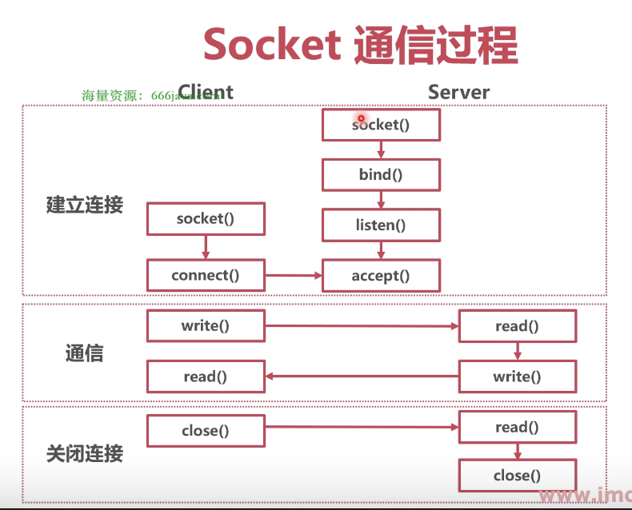
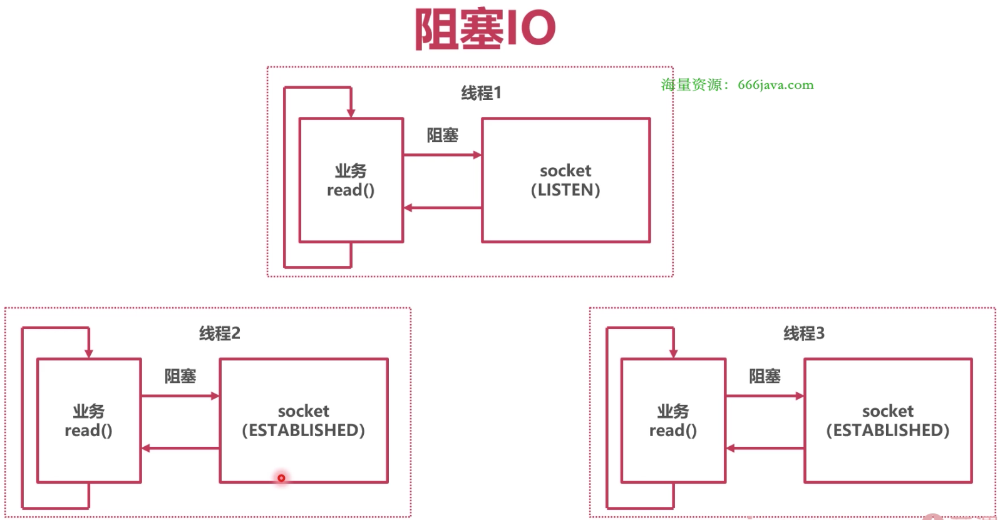
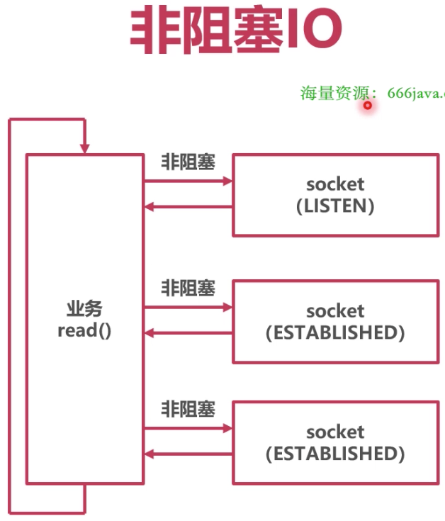
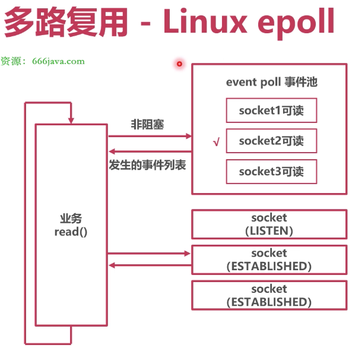

### Socket

TCP 实现起来非常麻烦，因此很多系统提供 Socket 作为 TCP 网络连接的抽象

Socket 底层就是一个握手好了的 TCP 连接

* Linux 下 Socket

Internet domain socket（负责网络通信的 Socket），底层为 SOCK_STREAM

Linux 中 Socket 以**文件描述符**（file descriptor，FD）作为标识

* Socket 通信过程

### IO 模型

* 什么是 IO 模型

IO 模型指的是同时操作 Socket 的方案

* 阻塞 IO

同步读写 Socket 时，线程陷入内核态，等待数据；读写成功后，切换回用户态，继续执行

优点：开发难度小，代码简单

缺点：内核态切换开销大

* 非阻塞 IO

如果暂时无法收发数据，会返回错误；应用会不断轮询，直到 Socket 可以读写

优点：不会陷入内核态，自由度高

缺点：需要自旋轮询

* 多路复用

向操作系统注册 Socket 事件；调用 epoll，当有事件发生，返回相应的 Socket FD 列表，用户态处理 FD

优点：提供了事件列表，不需要查询各个 Socket

缺点：开发难度大，逻辑复杂
