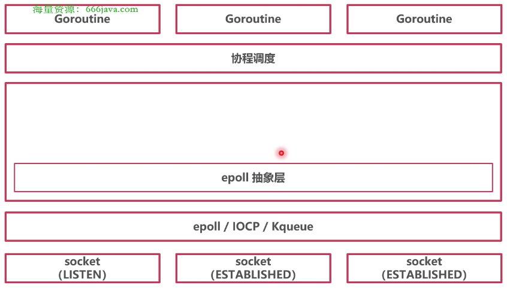

### 阻塞模型 + 多路复用

在底层使用操作系统的IO多路复用；在协程层次使用阻塞模型，阻塞协程时，休眠协程


### epoll 多路复用

* 实现的功能

epoll_create()：新建多路复用

epoll_ctl()：往多路复用器里插入需要监听的事件

epoll_wait()：查询发生的事件


### Go epoll

* 抽象

epoll 抽象层是为了统一各个操作系统对多路复用器的实现




* 系统指令集

```go
// syscall/zsysnum_linux_amd64.go
package unix

const (
	SYS_EPOLL_CREATE  = 213
	SYS_EPOLL_CREATE1 = 291
)
```


* netpollinit：新建多路复用器

1. 新建 epoll
2. 新建一个 pipe 管道用于中断 epoll
3. 将 "管道有数据到达" 事件注册在 epoll 中

```go
// runtime/netpoll_epoll.go/netpollinit
package runtime

// 对于操作系统 epoll 的描述
var epfd int32 = -1 // epoll descriptor

// 初始化 epoll
func netpollinit() {
	// 创建 epoll
	epfd = epollcreate1(_EPOLL_CLOEXEC)
	// 如果上面创建的有问题，再次创建
	if epfd < 0 {
		epfd = epollcreate(1024)
	}

	// 初始化一个管道（Linux 管道），管道用来关闭 epoll
	r, w, errno := nonblockingPipe()

	// 往 epoll 里添加事件（关闭管道的事件）
	errno = epollctl(epfd, _EPOLL_CTL_ADD, r, &ev)
}
```


* epoll_create（汇编实现：runtime/sys_linux_amd64.s/runtime.epollcreate）

```go
// runtime/netpoll_epoll.go
package runtime

// 创建 epoll
func epollcreate(size int32) int32

func epollcreate1(flags int32) int32
```

```assembly
// int32 runtime·epollcreate(int32 size);
TEXT runtime·epollcreate(SB),NOSPLIT,$0
    // 系统调用，创建 epoll
	MOVL    $SYS_epoll_create, AX
	SYSCALL
	RET

// int32 runtime·epollcreate1(int32 flags);
TEXT runtime·epollcreate1(SB),NOSPLIT,$0
    // 系统调用，创建 epoll
	MOVL	$SYS_epoll_create1, AX
	SYSCALL
	RET
```


* netpollopen：相当于操作系统的 epoll_ctl

1. 传入一个 Socket 的 FD 和 pollDesc 指针
2. 将 Socket 可读、可写、断开事件注册到 Epoll 中

```go
// runtime/netpoll_epoll.go/netpollopen
package runtime

// 增加一个事件
// 传入 Socket 的 fd，和 pollDesc 的指针
// pollDesc 中记录了哪个协程休眠等待此 Socket
func netpollopen(fd uintptr, pd *pollDesc) int32 {
	var ev epollevent
	// 四个事件：可读、可写、断开连接、监听模式
	ev.events = _EPOLLIN | _EPOLLOUT | _EPOLLRDHUP | _EPOLLET
	*(**pollDesc)(unsafe.Pointer(&ev.data)) = pd

	// 往 epoll 里添加事件
	return -epollctl(epfd, _EPOLL_CTL_ADD, int32(fd), &ev)
}
```


* netpoll：相当于操作系统的 epoll_wait

1. 调用 epoll_wait，查询有哪些事件发生
2. 根据 Socket 相关的 pollDesc 信息，返回哪些协程可以唤醒

```go
// runtime/netpoll_epoll.go/netpoll
package runtime

type gList struct {
	head guintptr
}

// netpoll checks for ready network connections
// 检查是否有事件发生
func netpoll(delay int64) gList {
	var events [128]epollevent

	// 系统调用 epollwait，初始化长度为 128 的数组用来接收事件
	n := epollwait(epfd, &events[0], int32(len(events)), waitms)

	// 没有事件发生
	if n < 0 {
		// 重试
	}

	// 协程列表
	var toRun gList
	for i := int32(0); i < n; i++ {
		// 读写标志位
		var mode int32
		if ev.events&(_EPOLLIN|_EPOLLRDHUP|_EPOLLHUP|_EPOLLERR) != 0 {
			mode += 'r'
		}
		if ev.events&(_EPOLLOUT|_EPOLLHUP|_EPOLLERR) != 0 {
			mode += 'w'
		}

		if mode != 0 {
			// 找到 Socket 在 Go 中的结构体描述
			pd := *(**pollDesc)(unsafe.Pointer(&ev.data))

			// 将协程放入列表
			netpollready(&toRun, pd, mode)
		}
	}

	// 返回可读、可写协程列表
	return toRun
}

// 判断 Socket 可读、可写情况
func netpollready(toRun *gList, pd *pollDesc, mode int32) {
	// 放入可读列表
	if rg != nil {
		toRun.push(rg)
	}

	// 放入可写列表
	if wg != nil {
		toRun.push(wg)
	}
}
```

```go
// syscall/zsyscall_linux_amd64.go/EpollWait
package syscall

func EpollWait(epfd int, events []EpollEvent, msec int) (n int, err error) {
	// 系统调用 epoll_wait
	r0, _, e1 := Syscall6(SYS_EPOLL_WAIT, uintptr(epfd), uintptr(_p0), uintptr(len(events)), uintptr(msec), 0, 0)
}
```
