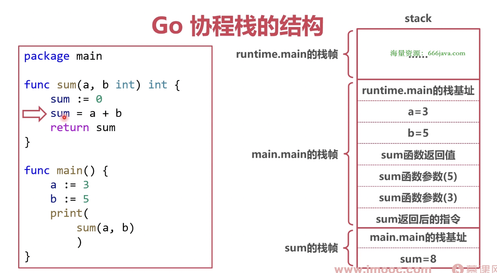

### Go 内存类型

* 静态类型

变量声明时候的类型

```go
package main

var a int
```

* 动态类型

程序运行时才能确定的类型

```go
package main

var a interface{}
```


### 协程栈

* 协程栈作用

1. 协程的执行路径
2. 局部变量
3. 函数传参
4. 函数返回值


* 协程栈位置

Go 协程栈位于 Go 的堆内存上，Go 堆内存位于操作系统的虚拟内存上


* 协程栈结构




### 参数传递

Go 参数传递为拷贝传递（也叫值传递）

值传递：函数传递的总是原来这个参数的一个副本，一副拷贝


* 传递

传递结构体：会拷贝结构体中的所有内容

传递结构体指针：会拷贝结构体指针
