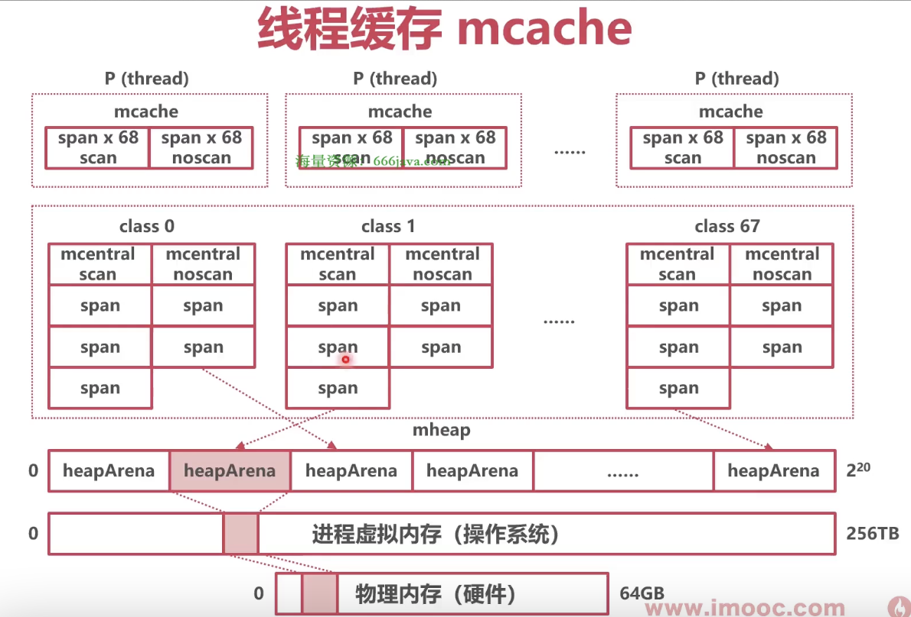
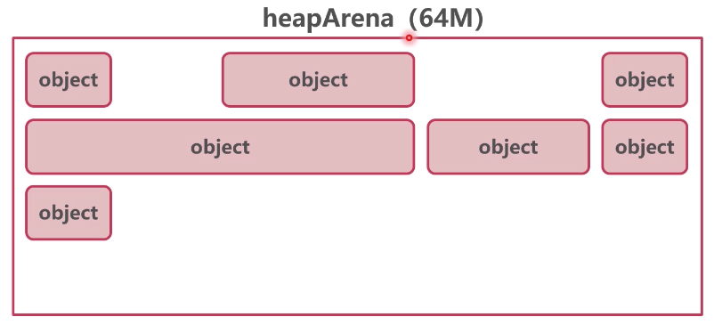
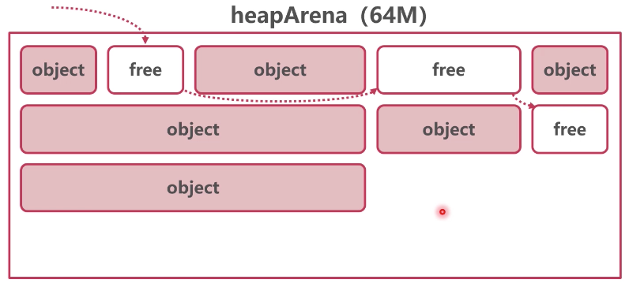
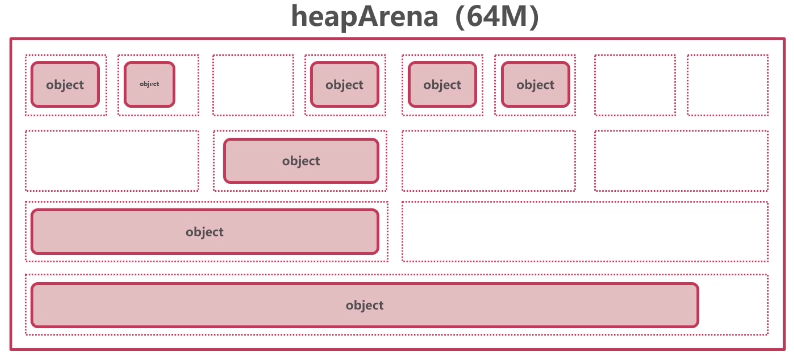
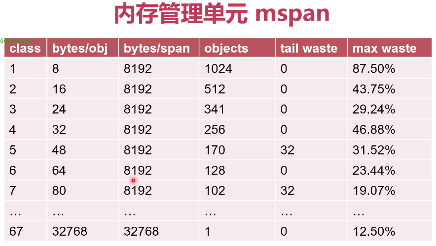

### Go 堆

Go 每次申请的虚拟内存单元（heapArena）为 64MB，最多可以申请 2^20 = 4194304 个 heapArena，所有的 heapArena 组成了 mheap（Go 堆内存）




### mheap 

* mheap 结构体

```go
// runtime/mheap.go/mheap
package runtime

const _NumSizeClasses = 68

const numSpanClasses = _NumSizeClasses << 1

// 描述 Go 堆内存
type mheap struct {
	allspans           []*mspan  // all spans out there
	
	arenas             [1 << arenaL1Bits]*[1 << arenaL2Bits]*heapArena // 记录所有的 heapArena
	
	// 描述 136 个 mcentral
	central [numSpanClasses]struct {
		mcentral mcentral
		pad      [cpu.CacheLinePadSize - unsafe.Sizeof(mcentral{})%cpu.CacheLinePadSize]byte
	}
}
```


### heapArena

* heapArena 结构体

```go
// runtime/mheap.go/heapArena
package runtime

const (
	pagesPerArena = heapArenaBytes / pageSize
)

// 记录申请到的 64 MB 内存信息
type heapArena struct {
	bitmap       [heapArenaBitmapBytes]byte
	spans        [pagesPerArena]*mspan      // span 的数组
	pageInUse    [pagesPerArena / 8]uint8
	pageMarks    [pagesPerArena / 8]uint8
	pageSpecials [pagesPerArena / 8]uint8
	checkmarks   *checkmarksMap
	zeroedBase   uintptr
}
```

* 内存分配

1. 
2. 
3. 

线性分配和链表分配容易出现内存碎片


### mspan

根据隔离适应策略，使用内存时的最小单位为 mspan；mspan 是一组相同的小内存单元，而不是一个小内存单元

* mspan 结构体

```go
// runtime/mheap.go/mspan
package runtime

type mspan struct {
	next *mspan     // next span in list, or nil if none
	prev *mspan     // previous span in list, or nil if none
}
```


* mspan 大小级别



```go
// runtime/sizeclasses.go
package runtime

// 级别    每个大小    总大小       数量                 最大浪费率
// class  bytes/obj  bytes/span  objects  tail waste  max waste
//     1          8        8192     1024           0     87.50%
//     2         16        8192      512           0     43.75%
//     3         32        8192      256           0     46.88%
//     4         48        8192      170          32     31.52%
//     5         64        8192      128           0     23.44%
//     6         80        8192      102          32     19.07%
//     7         96        8192       85          32     15.95%
//     8        112        8192       73          16     13.56%
//     9        128        8192       64           0     11.72%
//    10        144        8192       56         128     11.82%
//    11        160        8192       51          32      9.73%
//    12        176        8192       46          96      9.59%
//    13        192        8192       42         128      9.25%
//    14        208        8192       39          80      8.12%
//    15        224        8192       36         128      8.15%
//    16        240        8192       34          32      6.62%
//    17        256        8192       32           0      5.86%
//    18        288        8192       28         128     12.16%
//    19        320        8192       25         192     11.80%
//    20        352        8192       23          96      9.88%
//    21        384        8192       21         128      9.51%
//    22        416        8192       19         288     10.71%
//    23        448        8192       18         128      8.37%
//    24        480        8192       17          32      6.82%
//    25        512        8192       16           0      6.05%
//    26        576        8192       14         128     12.33%
//    27        640        8192       12         512     15.48%
//    28        704        8192       11         448     13.93%
//    29        768        8192       10         512     13.94%
//    30        896        8192        9         128     15.52%
//    31       1024        8192        8           0     12.40%
//    32       1152        8192        7         128     12.41%
//    33       1280        8192        6         512     15.55%
//    34       1408       16384       11         896     14.00%
//    35       1536        8192        5         512     14.00%
//    36       1792       16384        9         256     15.57%
//    37       2048        8192        4           0     12.45%
//    38       2304       16384        7         256     12.46%
//    39       2688        8192        3         128     15.59%
//    40       3072       24576        8           0     12.47%
//    41       3200       16384        5         384      6.22%
//    42       3456       24576        7         384      8.83%
//    43       4096        8192        2           0     15.60%
//    44       4864       24576        5         256     16.65%
//    45       5376       16384        3         256     10.92%
//    46       6144       24576        4           0     12.48%
//    47       6528       32768        5         128      6.23%
//    48       6784       40960        6         256      4.36%
//    49       6912       49152        7         768      3.37%
//    50       8192        8192        1           0     15.61%
//    51       9472       57344        6         512     14.28%
//    52       9728       49152        5         512      3.64%
//    53      10240       40960        4           0      4.99%
//    54      10880       32768        3         128      6.24%
//    55      12288       24576        2           0     11.45%
//    56      13568       40960        3         256      9.99%
//    57      14336       57344        4           0      5.35%
//    58      16384       16384        1           0     12.49%
//    59      18432       73728        4           0     11.11%
//    60      19072       57344        3         128      3.57%
//    61      20480       40960        2           0      6.87%
//    62      21760       65536        3         256      6.25%
//    63      24576       24576        1           0     11.45%
//    64      27264       81920        3         128     10.00%
//    65      28672       57344        2           0      4.91%
//    66      32768       32768        1           0     12.50%
```


### mcentral：是所有 mspan 的中心索引

一共有 136 个 mcentral：用来索引 68 个需要 GC 扫描的 mspan，68 个不需要 GC 扫描的 mspan

* mcentral 结构体

```go
// runtime/mcentral.go/mcentral
package runtime

type spanClass uint8

// A spanSet is a set of *mspans
type spanSet struct {
	spineLock mutex
	spine     unsafe.Pointer
	spineLen  uintptr
	spineCap  uintptr
	
	index     headTailIndex
}

// 用来索引同一级别的所有 mspan
type mcentral struct {
	spanclass spanClass  // span 级别，0 - 67
	
	partial   [2]spanSet // list of spans with a free object
	full      [2]spanSet // list of spans with no free objects
}
```


* mcentral 性能问题

mcentral 实际是中心索引，使用互斥锁保护，在高并发场景下，锁冲突问题严重

解决：使用 mcache，每个线程有一个 mcache，不需要上锁


### mcache：mcache 记录了分配给各个 P 的本地 mspan

每个 P（线程） 拥有一个 mcache
一个 mcache 拥有 136 个 mspan，其中 68 个需要 GC 扫描的 mspan，68 个不需要 GC 扫描的 mspan

* mcache 结构体

```go
// runtime/mcache.go/mcache
package runtime

const _NumSizeClasses = 68

const numSpanClasses = _NumSizeClasses << 1

type mcache struct {
	nextSample uintptr // trigger heap sample after allocating this many bytes
	scanAlloc  uintptr // bytes of scannable heap allocated

	tiny       uintptr
	tinyoffset uintptr
	tinyAllocs uintptr

	alloc      [numSpanClasses]*mspan // spans to allocate from, indexed by spanClass
	stackcache [_NumStackOrders]stackfreelist
	flushGen   uint32
}
```
