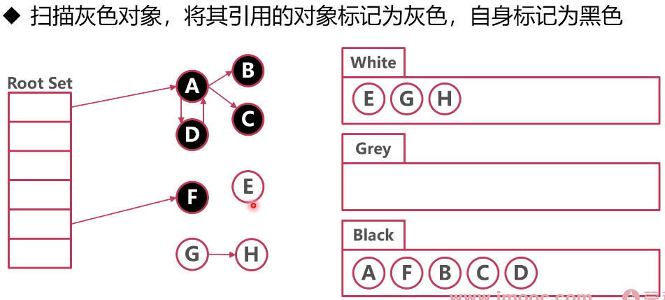

### 垃圾回收（Garbage Collecting）

* 标记-清除

将不再使用的内存标记后删除

缺点：可能会有内存碎片问题（Go 使用了分级分配，不存在这个问题）


* 标记-整理

将不再使用的内存标记后删除，并将其他的内存进行整理

有点：避免内存碎片

缺点：在整理过程中，开销大，会造成 GC 卡顿


* 标记 - 复制

将不再使用的内存标记，将其他使用的内存复制到新的内存区域

优点：避免内存碎片，并且复制的时间短

缺点：浪费内存空间


### Go GC

Go 因为堆内存结构的独特优势（分级分配），选择最简单的 "标记-清除" 策略，采用混合屏障（删除屏障 + 删除屏障）


### 标记-清除

标记有引用的对象，剩下就是没有引用的，需要清除

* Root Set（GC Root）：需要标记，不能被回收

1. 被栈上的指针引用

```go
package main

import "fmt"

type company struct {
	name string
}

func main() {
	// 假如 company 结构体逃逸到了堆上，p 本身在栈上
	// company 结构体被栈上的 p 指针引用
	p := &company{}
	fmt.Println(p)
}
```

2. 被全局变量指针引用

3. 被寄存器中的指针引用


* 可达性分析标记法

从 GC Root开始，使用广度优先搜索（BFS），将所有被 GC 引用的对象，进行标记


* 串行 GC 步骤

1. Stop The World，暂停所有其他协程（防止其他协程使用未被标记的对象）
2. 通过可达性分析，找到无用的堆内存
3. 释放无用堆内存
4. 恢复所有其他协程


* 串行 GC 的问题

1. STW 对性能影响大


### 并发标记：解决串行 GC 对性能的影响

* 三色标记法

黑色：有用，已经分析扫描（内部指针指向已经分析过）
灰色：有用，还未分析扫描
白色：暂时无用或未分析到


* 标记过程：见 images/007 系列图片 

1. 
2. 
3. 
4. 重复第 3 步，直到
5. 


* 删除问题

问题：并发标记时，被释放的对象被黑色对象引用，导致在回收时，被引用的对象被清理（见 images/008 系列图片）

解决：Yuasa 删除屏障（并发标记时，对于指针被释放的白色对象置灰）

杜绝在 GC 标记中被释放的指针被清理


* 插入问题

问题：并发标记时，黑色对象指向了未被引用的白色对象（见 images/009 系列图片）

解决：Dijkstra 插入屏障（并发标记时，对指针新指向的白色对象置灰）

杜绝在 GC 标记中被插入的指针被清理
