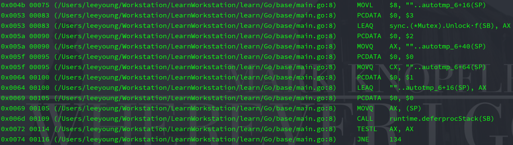
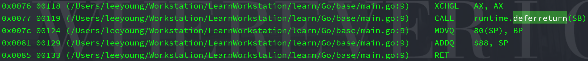

# defer


### 实验

* 实验代码

```go
package main

import "sync"

func a() {
	mu := sync.Mutex{}
	mu.Lock()
	defer mu.Unlock()
}

func main() {
	a()
}
```






### defer 实现

实现的两种方法

* 协程记录 defer 信息，函数退出时调用

在遇到 defer 语句时，将 defer 信息记录，在函数返回时，执行 deferreturn 方法，deferreturn 调用刚刚记录的 defer 信息


* 将 defer 代码直接编译进函数尾部

如果 defer 代码非常简单，直接将代码编译进函数尾部


### 协程记录 defer 信息，函数退出时调用

* 堆上分配（1.12 之前）

在**堆上**开辟一个 sched.deferpool，遇到 defer 语句，将信息放入 deferpool，函数返回时，从 deferpool 取出执行

```go
// runtime/runtime2.go
package runtime

// 协程结构体（runtime/runtime2.go/g）
type g struct {
	_defer       *_defer
}

// 协程队列结构体（runtime/runtime2.go/p）
type p struct {
	// 记录一些 defer
	deferpool    []*_defer // pool of available defer structs (see panic.go)
	deferpoolbuf [32]*_defer
}

// defer 结构体（runtime/runtime2.go/_defer）
// 每个 defer 结构体代表一个 defer 语句
type _defer struct {
	sp        uintptr
	pc        uintptr
	fn        func()
}
```

```go
// runtime/panic.go/deferreturn
package runtime

// 函数返回是调用 deferreturn
func deferreturn() {
	// 获取当前的 g
	gp := getg()
	
	for {
		// 获取 defer
		d := gp._defer
		// 调用 defer 方法
		done := runOpenDeferFrame(gp, d)
        // 释放 defer
		freedefer(d)
	}
}
```


* 栈上分配（1.13 之后）

遇到 defer 语句，将信息放入栈上，函数返回时，从栈中取出执行

优点：不分配在堆上，不用进行垃圾回收

缺点：但是栈上分配只能保存一个 defer 信息


### 将 defer 代码直接编译进函数尾部

* 开放编码（1.14 之后）

如果 defer 语句在编译时可以固定，直接改用户代码，defer 语句放入函数末尾（效率最高）
