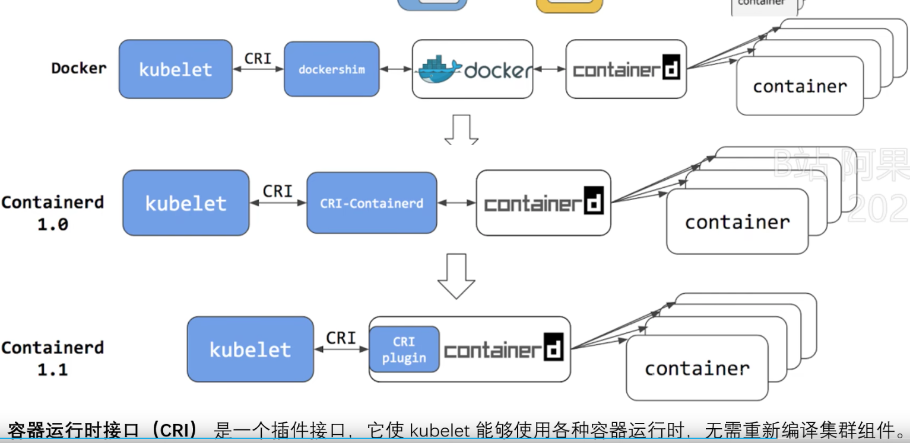

# CRI（container runtime interface，容器运行时接口）


### 基础

* 作用

Kubernetes 为了操作各种容器运行时（如 Docker、rkt、kata），规定的容器运行时标准，kubelet 通过 grpc 调用

其他容器厂商需要适配接入，实现自己的 CRI shim（比如 Docker，在 containerd 中集成了 CRI shim，所以 kubelet 在调用 Docker 时，直接调用的 containerd）


* 容器运行时接口 proto

[proto 地址](https://github.com/kubernetes/cri-api/blob/master/pkg/apis/runtime/v1/api.proto)

```protobuf
syntax = "proto3";

package runtime.v1;

// 容器相关操作
service RuntimeService {
    // Version returns the runtime name, runtime version, and runtime API version.
    rpc Version(VersionRequest) returns (VersionResponse) {}

    // RunPodSandbox creates and starts a pod-level sandbox. Runtimes must ensure
    // the sandbox is in the ready state on success.
    rpc RunPodSandbox(RunPodSandboxRequest) returns (RunPodSandboxResponse) {}
    // StopPodSandbox stops any running process that is part of the sandbox and
    // reclaims network resources (e.g., IP addresses) allocated to the sandbox.
    // If there are any running containers in the sandbox, they must be forcibly
    // terminated.
    // This call is idempotent, and must not return an error if all relevant
    // resources have already been reclaimed. kubelet will call StopPodSandbox
    // at least once before calling RemovePodSandbox. It will also attempt to
    // reclaim resources eagerly, as soon as a sandbox is not needed. Hence,
    // multiple StopPodSandbox calls are expected.
    rpc StopPodSandbox(StopPodSandboxRequest) returns (StopPodSandboxResponse) {}
    // RemovePodSandbox removes the sandbox. If there are any running containers
    // in the sandbox, they must be forcibly terminated and removed.
    // This call is idempotent, and must not return an error if the sandbox has
    // already been removed.
    rpc RemovePodSandbox(RemovePodSandboxRequest) returns (RemovePodSandboxResponse) {}
    // PodSandboxStatus returns the status of the PodSandbox. If the PodSandbox is not
    // present, returns an error.
    rpc PodSandboxStatus(PodSandboxStatusRequest) returns (PodSandboxStatusResponse) {}
    // ListPodSandbox returns a list of PodSandboxes.
    rpc ListPodSandbox(ListPodSandboxRequest) returns (ListPodSandboxResponse) {}

    // CreateContainer creates a new container in specified PodSandbox
    rpc CreateContainer(CreateContainerRequest) returns (CreateContainerResponse) {}
    // StartContainer starts the container.
    rpc StartContainer(StartContainerRequest) returns (StartContainerResponse) {}
    // StopContainer stops a running container with a grace period (i.e., timeout).
    // This call is idempotent, and must not return an error if the container has
    // already been stopped.
    // The runtime must forcibly kill the container after the grace period is
    // reached.
    rpc StopContainer(StopContainerRequest) returns (StopContainerResponse) {}
    // RemoveContainer removes the container. If the container is running, the
    // container must be forcibly removed.
    // This call is idempotent, and must not return an error if the container has
    // already been removed.
    rpc RemoveContainer(RemoveContainerRequest) returns (RemoveContainerResponse) {}
    // ListContainers lists all containers by filters.
    rpc ListContainers(ListContainersRequest) returns (ListContainersResponse) {}
    // ContainerStatus returns status of the container. If the container is not
    // present, returns an error.
    rpc ContainerStatus(ContainerStatusRequest) returns (ContainerStatusResponse) {}
    // UpdateContainerResources updates ContainerConfig of the container synchronously.
    // If runtime fails to transactionally update the requested resources, an error is returned.
    rpc UpdateContainerResources(UpdateContainerResourcesRequest) returns (UpdateContainerResourcesResponse) {}
    // ReopenContainerLog asks runtime to reopen the stdout/stderr log file
    // for the container. This is often called after the log file has been
    // rotated. If the container is not running, container runtime can choose
    // to either create a new log file and return nil, or return an error.
    // Once it returns error, new container log file MUST NOT be created.
    rpc ReopenContainerLog(ReopenContainerLogRequest) returns (ReopenContainerLogResponse) {}

    // ExecSync runs a command in a container synchronously.
    rpc ExecSync(ExecSyncRequest) returns (ExecSyncResponse) {}
    // Exec prepares a streaming endpoint to execute a command in the container.
    rpc Exec(ExecRequest) returns (ExecResponse) {}
    // Attach prepares a streaming endpoint to attach to a running container.
    rpc Attach(AttachRequest) returns (AttachResponse) {}
    // PortForward prepares a streaming endpoint to forward ports from a PodSandbox.
    rpc PortForward(PortForwardRequest) returns (PortForwardResponse) {}

    // ContainerStats returns stats of the container. If the container does not
    // exist, the call returns an error.
    rpc ContainerStats(ContainerStatsRequest) returns (ContainerStatsResponse) {}
    // ListContainerStats returns stats of all running containers.
    rpc ListContainerStats(ListContainerStatsRequest) returns (ListContainerStatsResponse) {}

    // PodSandboxStats returns stats of the pod sandbox. If the pod sandbox does not
    // exist, the call returns an error.
    rpc PodSandboxStats(PodSandboxStatsRequest) returns (PodSandboxStatsResponse) {}
    // ListPodSandboxStats returns stats of the pod sandboxes matching a filter.
    rpc ListPodSandboxStats(ListPodSandboxStatsRequest) returns (ListPodSandboxStatsResponse) {}

    // UpdateRuntimeConfig updates the runtime configuration based on the given request.
    rpc UpdateRuntimeConfig(UpdateRuntimeConfigRequest) returns (UpdateRuntimeConfigResponse) {}

    // Status returns the status of the runtime.
    rpc Status(StatusRequest) returns (StatusResponse) {}

    // CheckpointContainer checkpoints a container
    rpc CheckpointContainer(CheckpointContainerRequest) returns (CheckpointContainerResponse) {}

    // GetContainerEvents gets container events from the CRI runtime
    rpc  GetContainerEvents(GetEventsRequest) returns (stream ContainerEventResponse) {}

    // ListMetricDescriptors gets the descriptors for the metrics that will be returned in ListPodSandboxMetrics.
    // This list should be static at startup: either the client and server restart together when
    // adding or removing metrics descriptors, or they should not change.
    // Put differently, if ListPodSandboxMetrics references a name that is not described in the initial
    // ListMetricDescriptors call, then the metric will not be broadcasted.
    rpc ListMetricDescriptors(ListMetricDescriptorsRequest) returns (ListMetricDescriptorsResponse) {}

    // ListPodSandboxMetrics gets pod sandbox metrics from CRI Runtime
    rpc ListPodSandboxMetrics(ListPodSandboxMetricsRequest) returns (ListPodSandboxMetricsResponse) {}
}

// 镜像相关操作
service ImageService {
    // ListImages lists existing images.
    rpc ListImages(ListImagesRequest) returns (ListImagesResponse) {}
    // ImageStatus returns the status of the image. If the image is not
    // present, returns a response with ImageStatusResponse.Image set to
    // nil.
    rpc ImageStatus(ImageStatusRequest) returns (ImageStatusResponse) {}
    // PullImage pulls an image with authentication config.
    rpc PullImage(PullImageRequest) returns (PullImageResponse) {}
    // RemoveImage removes the image.
    // This call is idempotent, and must not return an error if the image has
    // already been removed.
    rpc RemoveImage(RemoveImageRequest) returns (RemoveImageResponse) {}
    // ImageFSInfo returns information of the filesystem that is used to store images.
    rpc ImageFsInfo(ImageFsInfoRequest) returns (ImageFsInfoResponse) {}
}
```

* kubelet 调用容器运行时历史演进


