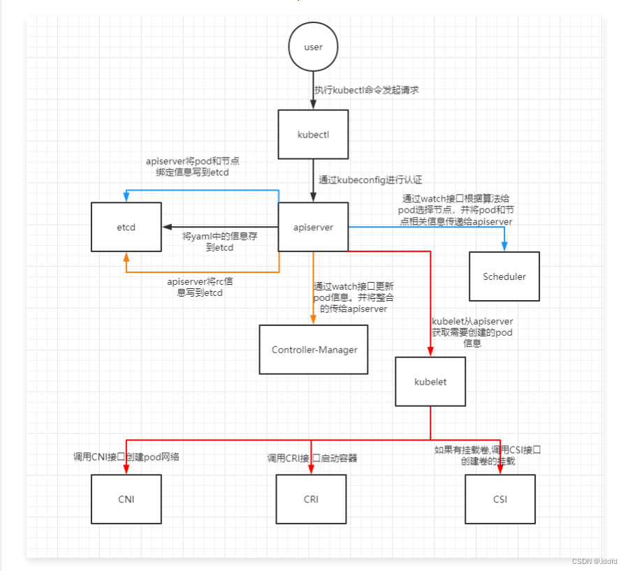

# pod 创建过程和生命周期

### pod 创建过程

1. 当执行 kubectl apply -f nginx.yaml 时，kubectl 通过 POST 方式与 APIServer 通信
2. APIServer 收到请求后，会创建一个标准的包含 pod 信息的 yaml 文件，并存入 etcd 中
3. scheduler 通过 APIServer 查询 etcd，发现一个 pod.spec.node 为空，进行调度计算，选择合适节点，结果会通过 APIServer 存入 etcd
4. kubelet 通过 APIServer 查询 etcd，发现有待创建的 pod，并且 node 为自己，调用 CRI 接口创建符合 OCI 标准的容器
5. kubelet 汇报容器的状态给 APIServer
