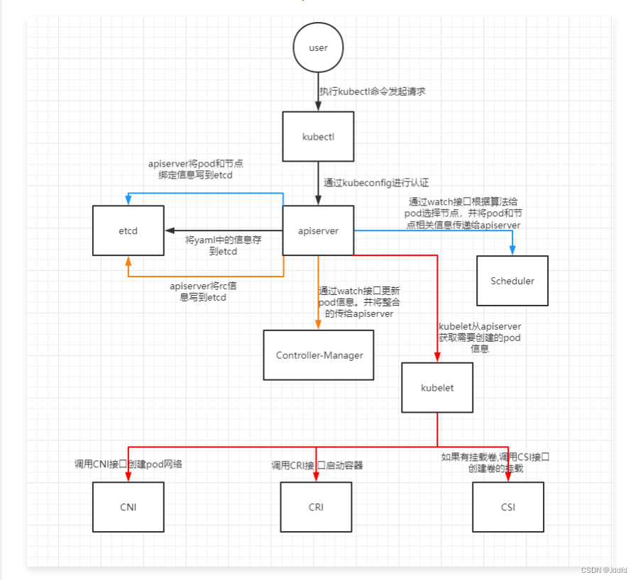

# Pod 创建过程和生命周期

### Pod 创建过程

1. 当执行 kubectl apply -f nginx.yaml 时，kubectl 通过 POST 方式与 APIServer 通信
2. APIServer 收到请求后，会创建一个标准的包含 pod 信息的 yaml 文件，并存入 etcd 中
3. scheduler 通过 APIServer 查询 etcd，发现一个 pod.spec.Node 为空，进行调度计算，选择合适节点，结果会通过 APIServer 存入 etcd
4. kubelet 通过 APIServer 查询 etcd，发现有待创建的 pod，并且 node 为自己，调用 CRI 接口创建符合 OCI 标准的容器
5. kubelet 汇报容器的状态给 APIServer

### Pod 生命周期

1. 创建状态为 pause 的 infra 容器，初始化 Pod 环境，提供共享的 namespace
2. 串行运行初始化容器（init container）进行 Pod 环境初始化
3. 启动主容器，多容器 Pod 中，并行启动所有应用容器（主容器、sidecar 容器），容器启动一刻运行 poststart 钩子事件
4. 运行定义的探针，startupProbe、livenessProbe、readinessProbe
5. 终止 Pod 对象，先运行 prestop 钩子事件，在宽限期结束后停止主容器
