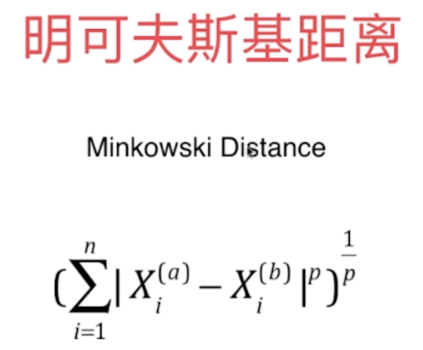

# K 近邻算法（K Nearest Neighbors）

### 优点和缺点

*  优点

1. 思想极度简单
2. 应用数学知识少
3. 效果好
4. 可以解释机器学习算法使用过程中的很多细节问题
5. 更完整的刻画机器学习应用的流程

* 缺点

1. 效率低下
2. 高度数据相关
3. 预测结果不具有可解释性
4. 维数灾难：随着维度的增加，"看似相近"的两个点之间的距离越来越大

### 判断机器学习算法的性能

* 问题

1. 模型很差怎么办
2. 真实环境难以拿到真实 label

### 超参数和模型参数

* 超参数：在算法运行前需要决定的参数

* 模型参数：算法过程中学习的参数

### 距离

P = 1，是曼哈顿距离
P = 2，是欧拉距离

### K 近邻算法中的超参数

* K

* P

### 数据归一化（Feature Scaling）：将所有数据映射到同一尺度中
 
* 最值归一化（normalization）

把所有数据映射到 0 - 1 之间，Xscale = (x - xmin)/(xmax - xmin)

适用于分布有明显边界的情况；受 outlier 影响较大

* 均值方差归一化（standardization）

把所有数据归一到均值为 0、方差为 1 的分布中

适用于数据分布没有明显的边界；有可能存在极端数据值
