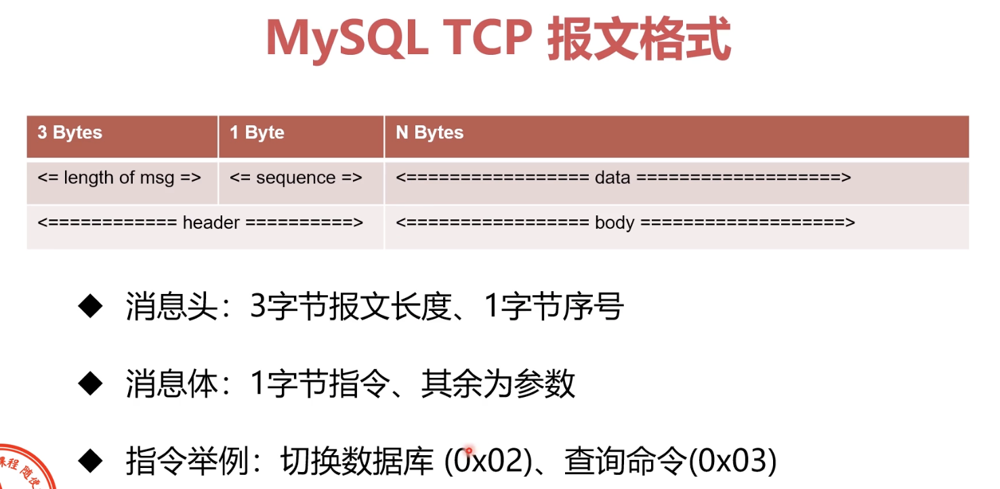

### 架构

* 架构

* SQL 语句执行流程

客户端 -> 连接器 -> 分析器 -> 优化器 -> 执行器 -> 存储引擎 -> 文件系统

* 连接器

用户密码认证通过，连接器到权限表里查询用户拥有的权限，之后这个连接里面的所有权限逻辑判断，都依赖此时读取到的权限

这也意味着，用户成功建立连接后，即使对权限做了修改，也不会影响已经存在的连接。只有再新建的连接才会使用新的权限设置

* 缓存

MySQL 8.0 之后已经停用

* 分析器：做什么

先词法分析，识别 SQL 语句中的关键字

再句法分析，判断 SQL 语句是否符合语法

* 优化器：怎么做

主要工作是决定如何使用索引、多表关联时决定各个表的连接顺序

* 执行器：

校验权限：校验此用户对目标数据有无权限

执行器以行为粒度，调用存储引擎，执行 SQL

在没有索引的情况下，执行器会循环查询所有行

### 客户端与 MySQL 连接方式

* TCP/IP 连接

* 命名管道

* 共享内存

* UNIX 域套接字

### MySQL TCP 通讯协议

* 过程

1. 三次握手建立 TCP 连接
2. 认证连接
3. 认证通过后，客户端开始与服务端之间交互
4. 断开 MySQL 连接
5. 四次挥手断开 TCP 连接

* 认证连接

1. 服务端 -> 客户端：发送握手初始化包
2. 客户端 -> 服务端：发送验证
3. 服务端 -> 客户端：认证结果消息

* 交互过程

1. 客户端 -> 服务端：发送命令包（Command Packet）
2. 服务端 -> 客户端：发送回应包

* 断开连接

1. 客户端 -> 服务端：发送退出命令包

* 报文格式

