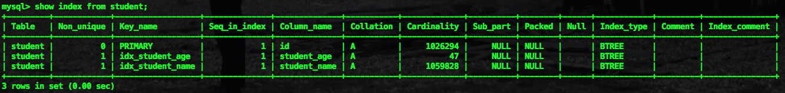

### 索引选择

* 原理

MySQL 在选取索引时，会参考，基数是 MySQL 估算的，反映这个字段有多少种取值（字段的区分度）

基数计算：选取几个页算出取值的平均值，再乘以页数

基数越大，证明字段的区分度越大，越优先被选择


* 强制使用索引

使用 FORCE INDEX 强制使用某个索引

```mysql
SELECT * FROM $table_name FORCE INDEX($index_name) WHERE 过滤语句;
```


* 重新统计索引信息

使用 analyze table 重新统计索引信息，会重新计算索引的基数


### 索引排查

```mysql
EXPLAIN SQL语句; 
```

