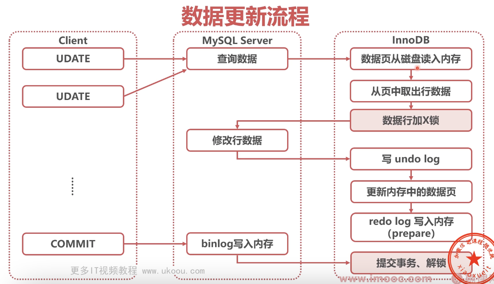

# 数据库日志

### BinLog（归档日志）

* 属性

MySQL server 层逻辑日志（记录数据变化，不记录物理数据页变化），记录数据库每次的数据操作，可作为数据闪回手段

* 作用

进行数据的复制和数据传送（主库传送给备库）

* 格式

statement：记录 SQL 语句原文，由于主备库对于 SQL 的执行不一致，可能有数据安全风险

### UndoLog（回滚日志）

UndoLog 是一条链表，链表头部是最新的旧记录，链表尾部最早的旧记录

* 属性

存储引擎层（InnoDB）产生的逻辑日志，记录数据的历史版本；对于任何数据（缓存）的更新，都先写 UndoLog

* 作用

事务回滚和展示旧版本，保证隔离性、原子性

* 为什么 UndoLog 能保证原子性

如果某条语句执行错误，需要执行回滚操作，通过 UndoLog去回滚

### RedoLog（重做日志）

* WAL（Write Ahead Log，预写日志）

先写日志，再写磁盘

* 属性

存储引擎层（InnoDB）产生的物理日志，记录数据页的变化；内存中的数据更新后写 RedoLog，数据被写入硬盘后删除，再将内存中的数据删除

* 作用

保证持久化

* 原理

由 4 个 1GB 文件组成的环状文件

write pos：当前日志写入点

check point：擦除点，数据被更新到硬盘时删除

当 write pos 追上 check point，事务无法提交，需要等待 check point 推进

* 问题

1. 当内存中的数据没有落盘，磁盘上的数据是脏的？

内存中的数据是正确的就可以

### 数据更新流程 和 二阶段提交

* 

获取数据 -> 判断是否在内存中（如果不在从磁盘中读取数据到内存）-> 返回数据（**引擎层**）

-> 修改行数据（**执行器层**）

-> 写 UndoLog -> 更新内存中的数据页 -> 写 RedoLog 到内存，此时标记为 prepare 状态（**引擎层**）

-> 写 BinLog 到内存（**执行器层**）

-> 提交事务，处于 commit 状态（**执行器层**）

* 注意⚠️

RedoLog 每次更新操作都写入，BinLog 每次 commit 才写入

### RedoLog 和 BinLog 刷盘

* innodb_flush_log_at_trx_commit：控制 RedoLog 刷盘时机

0：异步每秒刷盘（每秒将**内存中**的 RedoLog 刷到磁盘），最多丢失 1秒 数据
1：每1个事务刷盘（每1次 commit 时刷盘），推荐
N：每N个事务刷盘（每N次 commit 时刷盘）

* sync_binlog：控制 BinLog 刷盘时机

0：自动控制刷盘（MySQL server 层控制刷盘时机）
1：每1个事务刷盘（每1次 commit 时刷盘），推荐
N：每N个事务刷盘（每N次 commit 时刷盘）
