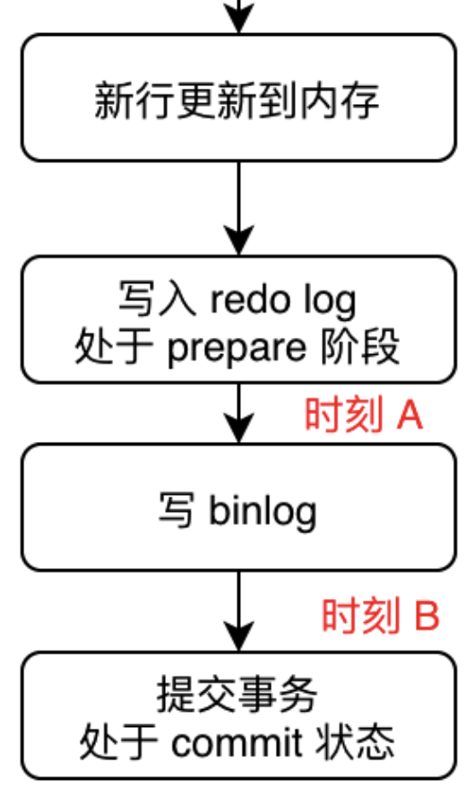

### 数据更新流程

* 数据更新流程

大体为：更新内存数据 -> 写入 RedoLog，处于 prepare 状态 -> 写 BinLog -> 提交事务，处于 commit 状态

* 持久化分析：假设刷盘时机均为每个事务刷盘

1. 假如在 '时刻A'，写入 RedoLog，处于 prepare 状态，写 BinLog 之前发生崩溃

奔溃恢复的时候，由于 BinLog 还没写，RedoLog 也还没提交，所以这个事务会回滚

BinLog 还没写，所以也不会传到备库

2. 假如在 '时刻B'，写入 BinLog，RedoLog 还没有 commit 时发生崩溃

奔溃恢复的时候，判断事务的 BinLog 是否存在并且完整，如果是，则提交事务，如果否，则回滚事务

* 崩溃恢复过程

RedoLog 和 BinLog 有一个共同的数据字段，叫 XID；奔溃恢复时，会按顺序扫描 RedoLog

1. 如果碰到既有 prepare，又有 commit 的 RedoLog，直接提交

2. 如果碰到只有 prepare，没有 commit 的 RedoLog，拿 XID 去 BinLog 找对应的事务，如果 BinLog 完整，则 提交，不完整则 回滚

### RedoLog VS BinLog

* RedoLog 和 BinLog 区别

|          |                     RedoLog                     |              BinLog              |
| :------: | :---------------------------------------------: | :------------------------------: |
|  工作层  |                     引擎层                      |         MySQL server 层          |
| 日志属性 | 物理日志，记录的是 "在某个数据页上做了什么修改" | 逻辑日志，记录的是语句的原始逻辑 |
| 写入方式 |           循环写入，固定的空间会用完            |             追加写入             |

### 问题

* 为什么 RedoLog 直接写入磁盘，而数据需要先缓存在内存中，合适的时机刷入磁盘

RedoLog 为顺序读写，数据写入随机读写，因此 RedoLog 写入的很快，数据的写入很慢

* 为什么 RedoLog 在 BinLog 之前

BinLog 一旦写入无法撤回，因为可能已经被传送至备库

* 怎么判断 BinLog 的完整性

一个事务的 BinLog 有完整格式

statement 格式的 BinLog，最后会有 commit

row 格式的 BinLog，最后会有 XID event

* 为什么用二阶段提交

二阶段提交是保证 RedoLog 和 BinLog 两份日志的一致

RedoLog prepare -> BinLog -> RedoLog commit

主要是用 BinLog 恢复数据

如果在 prepare 后崩溃，重启后发现没有 commit，会进行回滚；在 RedoLog 和 BinLog 不存在这个更新数据

如果在 BinLog 后崩溃，重启后发现没有 commit，会进行 commit；在 RedoLog 和 BinLog 中存在这个更新数据

* 不使用二阶段提交有什么问题

⚠️重要：这里首先需要明确的是，数据的恢复是通过 RedoLog 进行

假如不使用二阶段提交，有以下两种情况

1. 先写 RedoLog（直接为 commit 状态）再写 BinLog，写完 RedoLog 后数据库崩溃

恢复时，使用 RedoLog 恢复数据，则数据比 BinLog 中的数据要多

2. 先写 BinLog 再写 RedoLog，写完 BinLog 后数据库崩溃

恢复时，使用 RedoLog 恢复数据，则数据比 BinLog 中的数据要少

### 能否只用一种日志问题

* 能否只用 RedoLog，不用 BinLog

如果从崩溃恢复的角度看是可以的（直接拿 RedoLog 恢复数据页就可以了），但是 BinLog 有两个重要功能

1. 归档：RedoLog 是循环写，历史日志无法保留，起不到归档的作用

2. MySQL server 依赖 BinLog：如主从复制等

⚠️⚠️⚠️
* 能否只用 BinLog，不用 RedoLog

BinLog 没有 crash-safe 能力

1. 先提交事务，再写入 BinLog 日志：假如事务提交后，数据落盘，还未写入 BinLog，数据库崩溃；崩溃恢复时，数据和日志不一致，且无法根据日志恢复数据（除非从头重放 BinLog 日志）

2. 根据 WAL，先写入 BinLog 日志，再提交事务：假如 BinLog 写入后，事务还未提交，数据库崩溃；奔溃恢复时，
