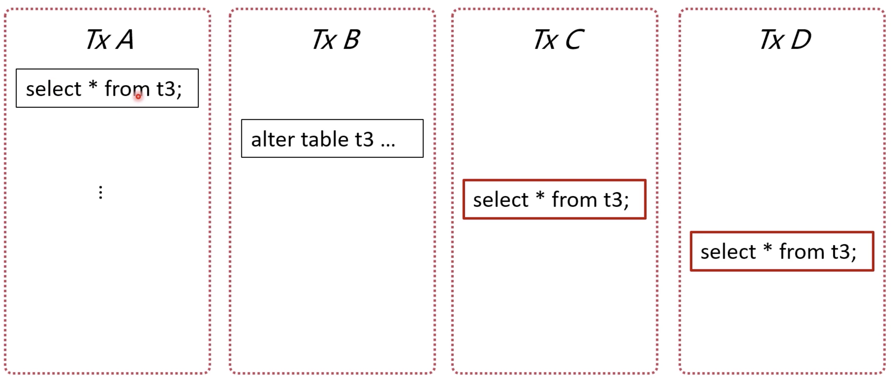
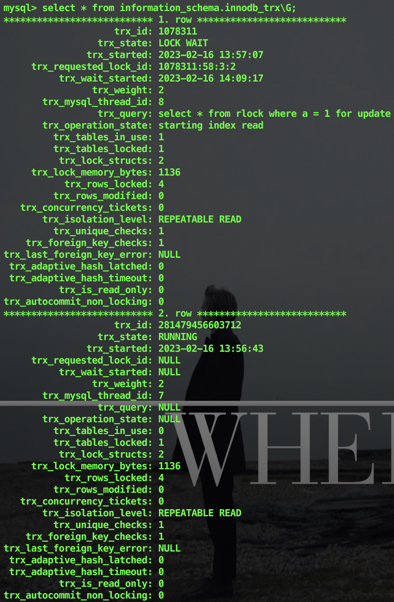
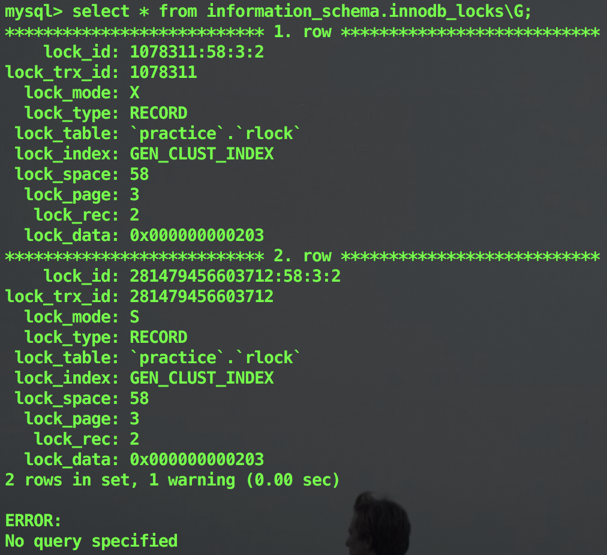

### 长事务问题 - 锁无法释放

* 行级锁长时间无法释放，导致其他事务等待

当前读会对数据行加锁，事务提交前无法释放，其他事务更新相同数据时等待锁，造成更新性能差

解决办法：调整 innodb_lock_wait_timeout（默认 50，等待 50秒 还未获取锁，当前语句报错）参数


* 容易产生死锁

死锁：两个事务都依赖对方的锁释放

主动死锁检测：innodb_deadlock_detect，发现死锁时，回滚代价较小的事务

```mysql
# 事务 A、B 开启事务
BEGIN;

# 事务 A 执行语句
SELECT * FROM t WHERE id = 10 FOR UPDATE;

# 事务 B 执行语句
SELECT * FROM t WHERE id = 20 FOR UPDATE;

# 事务 A 执行语句
SELECT * FROM t WHERE id = 20 FOR UPDATE;

# 事务 B 执行语句
SELECT * FROM t WHERE id = 10 FOR UPDATE;
```


* 元数据锁（MDL）hold 住大量事务，造成 MySQL 崩溃

事务访问数据时，会自动给表加 MDL 读锁，事务修改元数据时（如加一列、加索引），会自动给表加 MDL 写锁



遇到锁不兼容时，申请 MDL 锁的事务形成一个队列

修改元数据前（如 ALTER TABLE），查看是否有长事务还未提交


### 系统表

* MySQL 5.7

查看长事务：information_schema 库 INNODB_TRX 表

查看锁：information_schema 库 INNODB_LOCKS 表

查看阻塞事务：information_schema 库 INNODB_LOCK_WAITS


* MySQL 8.0

查看锁：performance_schema 库 data_locks 表

查看阻塞事务：performance_schema 库 data_lock_waits 表

查看 MDL 锁：performance_schema 库 metadata_locks 表


* 查看事务表

```mysql
SELECT * FROM information_schema.innodb_trx\G;
```




* 查看锁表

```mysql
SELECT * FROM information_schema.innodb_locks\G;
```




### 业务上建议

1. 控制长事务，没有必要情况下不开启事务
2. 数据修改（当前读）尽量放在事务后部，降低锁时间
