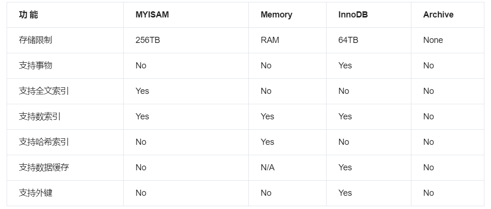

# 存储引擎


* 存储引擎

MySQL 可以将数据以不同的技术存储到文件（内存）中，这种技术称为存储引擎，每种存储引擎使用不同的存储机制、索引技巧、锁定水平


* 存储引擎任务

将执行器的指令落实在数据文件上


* 命令

```mysql
# 查看所有支持存储引擎
SHOW ENGINES;

# 查看当前存储引擎
SHOW VARIABLES LIKE "%storage_engine%";

# 修改存储引擎
ALTER TABLE 表名 ENGINE=存储引擎类型;
```

```mysql
# 查看存储引擎状态
SHOW ENGINE innodb STATUS\G

# 查看InnoDB存储引擎的页大小，单位 Byte
SHOW GLOBAL STATUS LIKE 'Innodb_page_size';
```


### 存储引擎比较




* MyISAM：MySQL 5.5.5 之前默认存储引擎

插入数据快：功能少速度快

空间利用率高：没有各种日志

不支持事物


* InnoDB：MySQL 5.5.5 之后默认存储引擎

支持事物、外键

支持崩溃修复能力和并发控制（MVCC）


* Memory

速度快：数据存在内存中

数据安全性差


* Archive

数据压缩、空间利用率高

插入速度快

不支持索引，查询性能差
