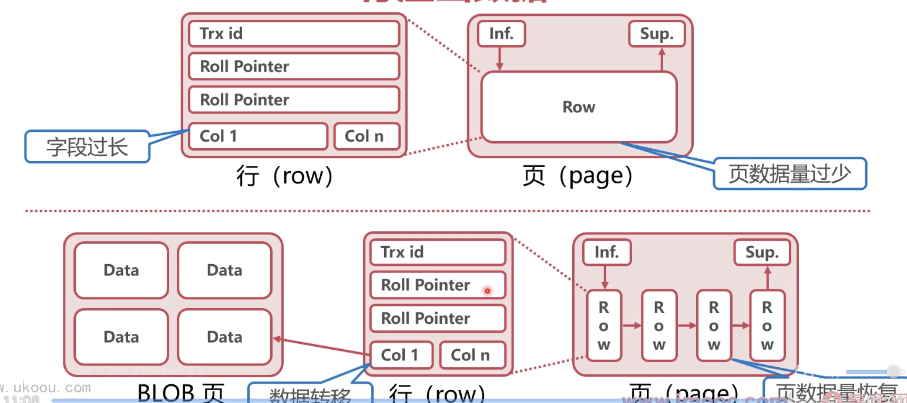

### 变长列（变长指数据在磁盘中存储的空间有可能长有可能短）

* 长度不固定的数据类型

VARCHAR、VARBINARY、BLOB、TEXT

* 占用空间大于 768 字节的 CHAR

* 变长编码（如 UTF-8）下的 CHAR

### 行溢出数据

InnoDB 每个数据页容量有限（16KB），导致字段长度也有限，当字段过大时，InnoDB 会使用行溢出机制，行溢出机制会把超长字段放入单独开辟的数据页

