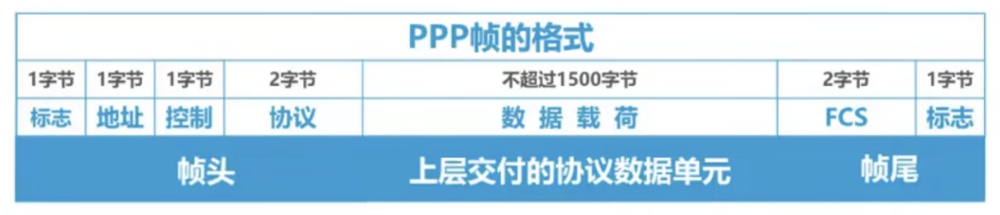
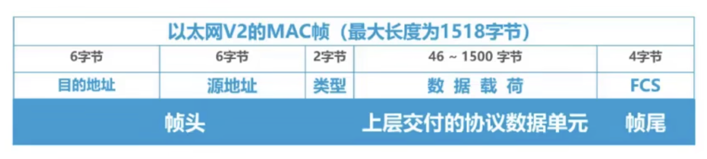

# 封装成帧

### PPP帧

* 帧头 和 帧尾

帧头和帧尾中包含有重要的控制信息

帧头和帧尾的作用之一就是帧定界

* 帧定界

PPP帧 在**帧头和帧尾**处都有 1 个字节的标志，用来定界帧

### 以太网帧

* 帧定界

以太网帧 没有帧定界标志，在交付给物理层时，物理层在 MAC帧 前面添加 8字节 的前导码，然后发送

前导码：7字节 前同步码 + 1字节 帧开始定界符

以太网规定帧间间隔为**96比特**的发送时间

### 透明传输

* 什么是透明传输

指数据链路层对上层交付的传输数据没有任何限制，就好像数据链路层不存在一样

* 透明传输方法

1. 面向字节的物理链路使用字节填充（或称字符填充）的方法实现透明传输

发送方在发送数据帧前，对帧进行扫描，如果发现存在帧定界符/转义字符，就在前面插入一个转义字符ESC

2. 面向比特的物理链路使用比特填充的方法实现透明传输

帧定界符为：01111110（连续 6 个 1），在发送前，对数据部分进行扫描，每 5 个连续的比特 1 后面插入 1 个 0

### 注意⚠️

为了提高帧的传输效率，应当使帧的数据部分的长度尽可能大些
