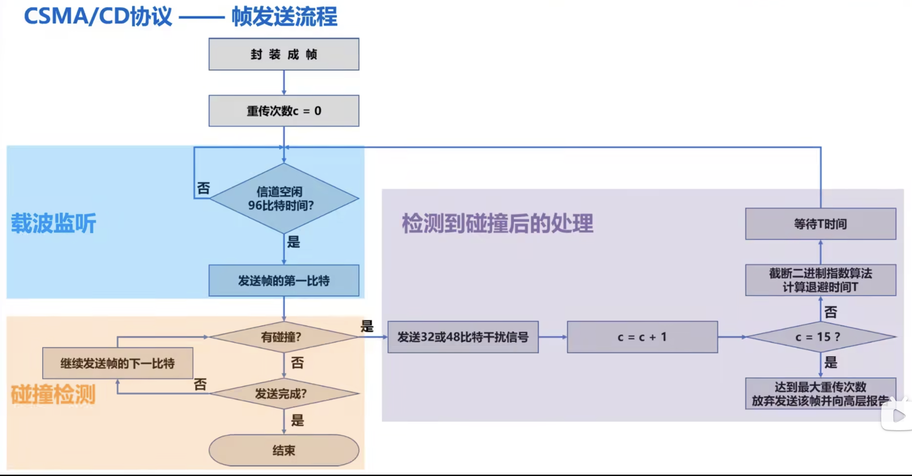
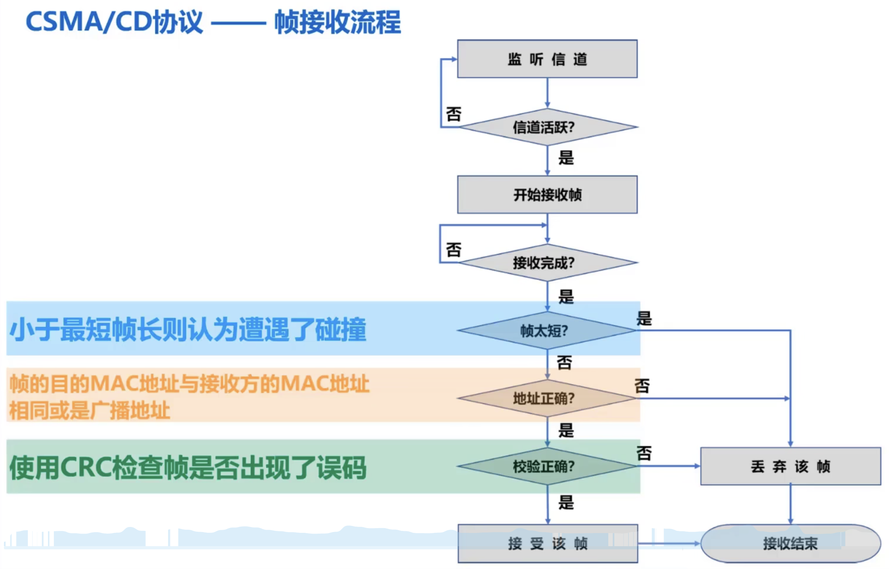

# 媒体接入控制 - CSMA/CD

### CSMA/CD（载波监听多路访问/碰撞检测，Carrier Sense Multiple Access with Collision Detection）

* 多路访问（多址接入）

多个站点连接在一条总线上，竞争使用总线

* 载波监听

每个站在发送帧之前先要检测一下总线上是否有其他站点在发送帧

若检测到总线空闲**96比特时间**，则发送这个帧；若检测到总线忙，则继续检测并等待总线转为空闲96比特时间

* 碰撞检测

每个正在发送帧的站边发送边检测碰撞

一旦发现总线上出现碰撞，则立即停止发送，退避一段随机时间后再次发送

### 争用期（碰撞窗口）

* 举例

A 到 D 总的传播时延为 τ

0 时间时，A 检测到信道空闲，发送数据

τ - δ 时间时，D 检测到信道空闲，发送数据；此时 从 A 发送的数据已经走 τ - δ，A 的数据距离 D 时间为 δ

A 和 D 的数据同时传播，在中间碰撞，此时碰撞时间点为 τ - δ + δ/2 = τ - δ/2

D 检测到碰撞的数据往回传输的时间为 δ/2，D 检测到碰撞总的时间 (τ - δ/2) + δ/2 = τ

A 检测到碰撞的数据往回传输的时间为 τ - δ/2，A 检测到碰撞时间 (τ - δ/2) + τ - δ/2 = 2τ - δ

* 争用期

主机最多经过 2τ 的时长就可检测到本次发送是否遭受了碰撞，因此，以太网端到端往返传播时延 2τ 称为争用期

经过争用期这段时间还没有检测到碰撞，才能肯定这次发送不会发生碰撞

### 最小帧长

以太网规定最小帧长为 64 字节，即 512比特（512比特时间为争用期）；如果发送的数据少，需要加入填充数据，使帧长不小于 64 字节

以太网的最小帧长确保了主机可在帧发送完成之前就检测到该帧的发送过程中是否遭遇了碰撞

### 最大帧长

数据部分长度为 46 - 1500 字节，加上帧头、帧尾长度为 64 - 1518字节

### 退避时间

* 概念

发生碰撞后，站点举例下次发送的间隔时间

* 计算方法（截断二进制指数退避算法）

退避时间 = 基本退避时间 * 随机数 r

基本退避时间：争用期 2τ

随机数 r：从离散的整数集合 {0, 1, ..., 2^k - 1} 中随机选出一个数，k = Min(重传次数, 10)

* 说明

1. 若连续发生多次碰撞，表明可能有较多的主机参与竞争信道。使用退避算法可使重传需要推迟的平均时间随重传次数而增大，因而减小发生碰撞的概率，有利于整个系统的稳定

2. 当重传达 16次 仍不能成功时，表明同时发送帧的主机太多，以至于连续发生碰撞，则丢弃该帧，并向上层报告

### 帧发送、接收流程

### 注意⚠️

* 强化碰撞

在以太网链路中，当发送帧的站点一旦检测到碰撞，除了立即停止发送外，还要再继续发送 32bit/48bit 的人为干扰信号，以便有足够多的碰撞信号使所有站点都能检测出碰撞
