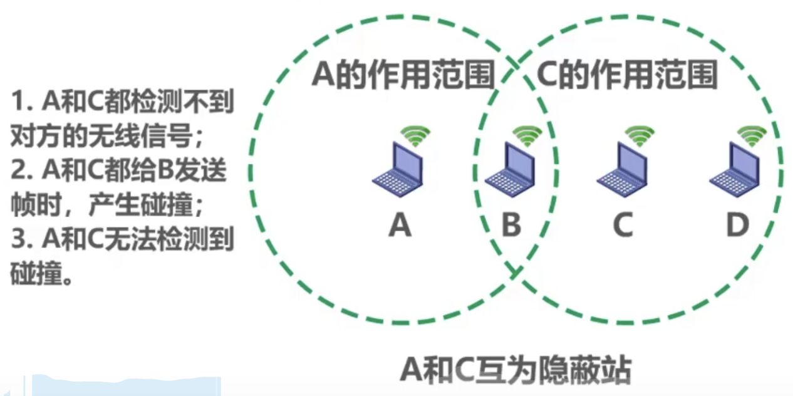

# 媒体接入控制 - CSMA/CA

### CSMA/CA（载波监听多路访问/碰撞避免，Carrier Sense Multiple Access with Collision Avoidance）

* 无线局域网中为什么不能使用CSMA/CD

1. 由于无线信道的传输条件特殊，其信号强度动态范围非常大，无线网卡上接收到的信号强度往往会远小于发送信号的强度。如果在无线网卡上实现碰撞检测，对硬件要求非常高

2. 即使能够在硬件上实现无线局域网的碰撞检测功能，但由于无线电波传播的特殊性（存在问题），进行碰撞检测意义不大
