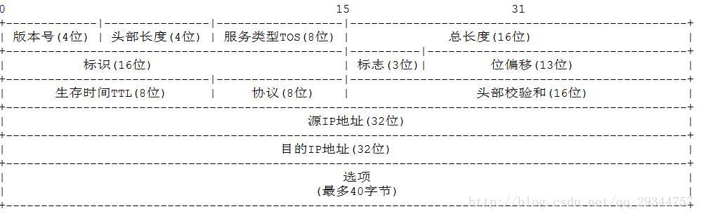

# IP协议

### 报文头

* 版本

占 4 位

表示 IP 协议版本，通信双方使用的 IP 协议版本必须一致，

* 首部长度

占 4 位

表示 IP 数据报首部长度，单位为 4 字节，取值范围 5-15

* 服务类型（现在叫 "区分服务"）

占 8 位

用来获得更好的服务

利用该字段的不同数值可提供不同等级的服务质量；一般情况不使用该字段

* 总长度

占 16 位

表示 IP 数据报的总长度（首部 + 数据载荷），单位为字节

* 标识、标志、片偏移（用于 IP 数据报分片）

标识：占 16 位，属于同一个数据报的各分片数据报应该具有相同的标识

标志：占 3 位

DF位：1 表示不允许分片，0 表示允许分片
MF位：1 表示后面还有分片，0 表示是最后一个分片
保留位：必须为 0

片偏移：占 13 位，指出分片数据报的数据载荷部分偏移其原数据报的位置有多少个单位，单位为 8 字节

* 生存时间 TTL（Time To Live）

占 8 位

最初以秒为单位，最大生存周期为 255 秒。路由器在转发 IP 数据报时，将 IP 数据报中该值减去 IP 数据报在本路由器耗费时间，不为 0 转发，为 0 丢弃

现在以跳数为单位，每经过一个路由器减 1，不为 0 转发，为 0 丢弃

* 协议

占 8 位

指明 IPv4 数据报的数据部分是何种协议数据单元

ICMP 为 1、IGMP 为 2、TCP 为 6、UDP 为 17、IPv6 为 41、OSPF 为 89

* 头部校验和

占 16 位

用来检测首部在传输过程中是否出现差错

IP 数据报每经过一个路由器，路由器都要重新计算首部检验和，因为某些字段（生存时间、标志、片偏移）的取值可能发生变化

由于 IP 层本身不提供可靠传输服务，并且计算首部校验和是耗时操作，因此在 IPv6 中，路由器不再计算校验和，从而更快转发 IP 数据报

* 源 IP 地址、目的 IP 地址

各占 32 位

* 可选字段

1 - 40 字节不等

用来支持排错、测量及安全等措施

可选字段增加了 IP 数据报的功能，但同时使 IP 数据报首部可变，增加了路由器处理 IP 数据报的开销；实际上可选字段很少被使用

### 注意⚠️

1. 选项长度可变，需要填充，确保报文首部能被 4 整除
