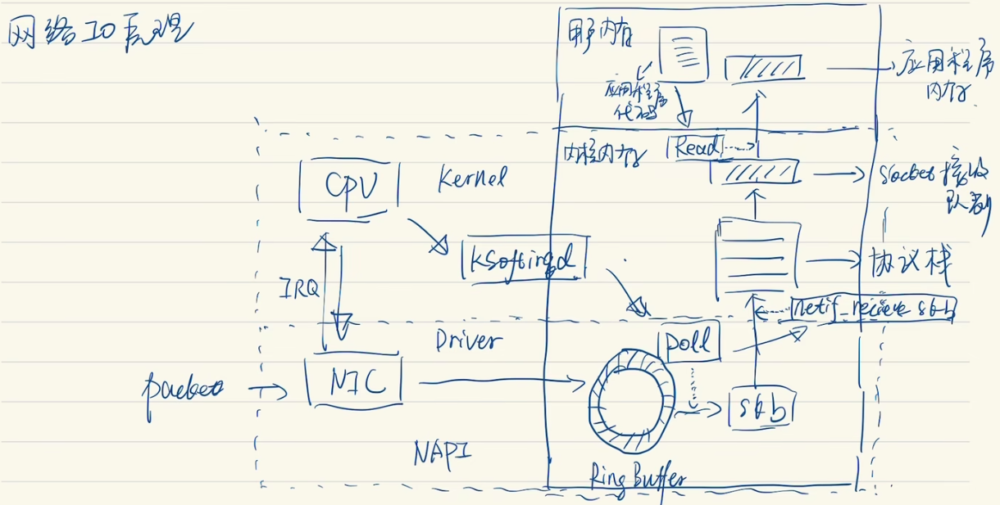

# 网卡收包过程

### 网卡收包过程

* 

1. 包到达网卡（NIC），网卡将包数据 DMA 到 RingBuffer，网卡向 CPU 发起**硬中断**
2. CPU disable 硬中断，CPU 发起**软中断（ksoftirqd）**
3. 软中断调用**驱动层 poll** 将包数据取出来，变成 skb（socket buffer）
4. poll 去调用内核 netif_receive_skb，netif_receive_skb 将数据包送入**内核的网络协议栈L**处理
5. 协议栈处理完成后，将数据送入 **socket 接收队列**
6. CPU 取消 disable 硬中断，网卡可以继续接收数据包

* 问题

1. 为什么 disable 硬中断

因为硬中断不可以被打断，如果硬中断处理，可能导致 CPU 被卡住，所以使用软中断去异步处理
