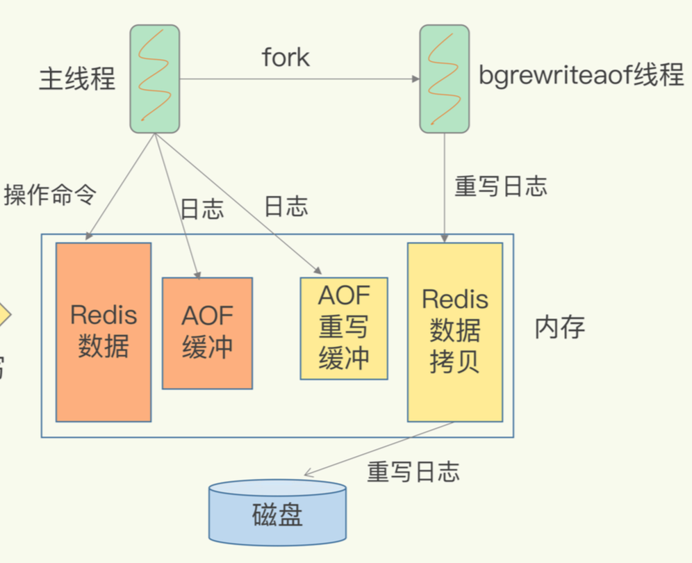

# AOF（Append Only File）日志


### AOF 工作过程

AOF 为后写日志（先写命令，再写日志），保存的是操作记录

客户端执行完命令后，会写入到 AOF_buf 缓存区（减少磁盘IO），执行 sync 操作，写入 AOF文件


### 缓存区同步到文件

* 问题

1. Redis 写完数据没写日志就宕机了，无法使用日志进行恢复，导致数据丢失
2. AOF 日志工作在主线程中，如果磁盘压力大、读写慢时，导致 Redis 线程阻塞


* 同步方式

```bash
# 每次命令都同步
appendfsync always

# 每秒同步一次
appendfsync everysec

# 不做处理，交给操作系统处理
appendfsync no
```


### AOF 重写机制

* 日志文件过大带来的问题

1. 文件系统本身对文件大小有限制
2. 文件过大，追加命令变慢
3. 如果发生宕机，文件过大，数据恢复慢


* 解决方法

AOF 重写机制


* 

1. 主进程拷贝出 bgrewriteaof 子进程，将内存拷贝一份给子进程
2. 子进程将内存中的数据重写为 AOF 日志
3. 此时主进程仍然可以处理新操作，写入两份日志缓冲，一份 AOF 缓冲，一份 AOF 重写缓冲
4. AOF 数据重写完成后，再将 AOF 重写缓冲中的数据写入到重写 AOF 日志中


* 问题

1. AOF重写会拷贝一份完整的内存数据，这个会导致内存占用直接翻倍吗

使用的**写时复制**，主进程在处理新操作时，会将内存再拷贝一份给子进程，子进程读到的还是以前的数据


### 优缺点

* 缺点

如果日志文件过大，宕机恢复时间过长
