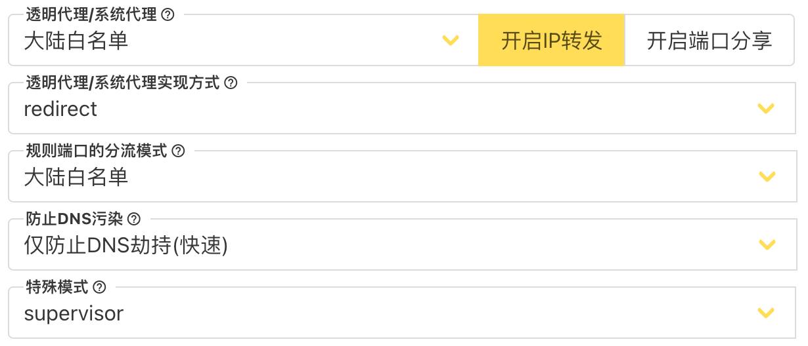

### 服务搭建

```bash
# 拉取镜像
docker pull mzz2017/v2raya:1.5.8

# 启动服务
docker run -d \
  --restart=always \
  --privileged \
  --network=host \
  --name v2raya \
  -e V2RAYA_LOG_FILE=/tmp/v2raya.log \
  -e V2RAYA_V2RAY_BIN=/usr/bin/v2ray \
  -e V2RAYA_NFTABLES_SUPPORT=off \
  -v /lib/modules:/lib/modules:ro \
  -v /etc/resolv.conf:/etc/resolv.conf \
  -v /etc/v2raya:/etc/v2raya \
  mzz2017/v2raya:1.5.8
```

* 账户信息

用户: lee
密码: leeyoung

* 设置



