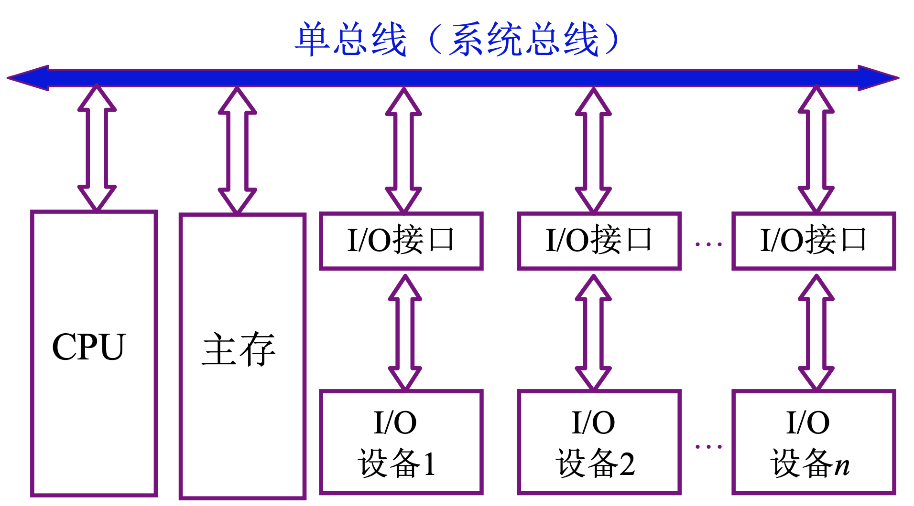
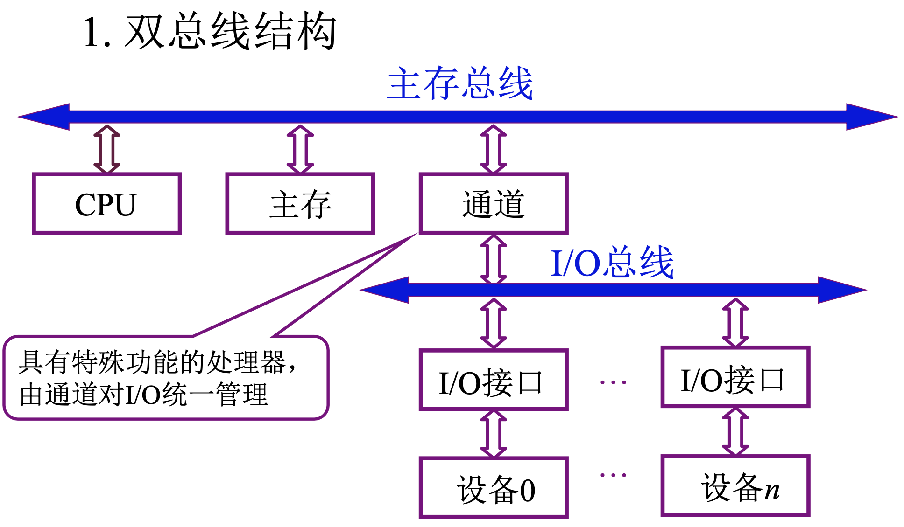
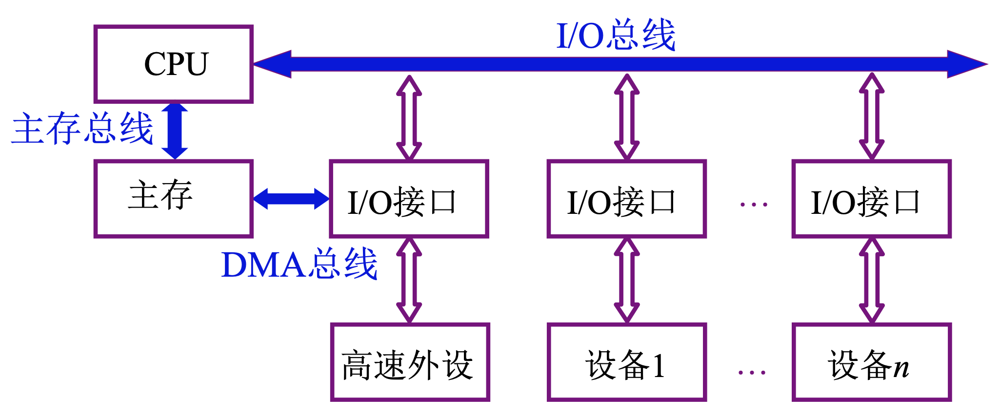
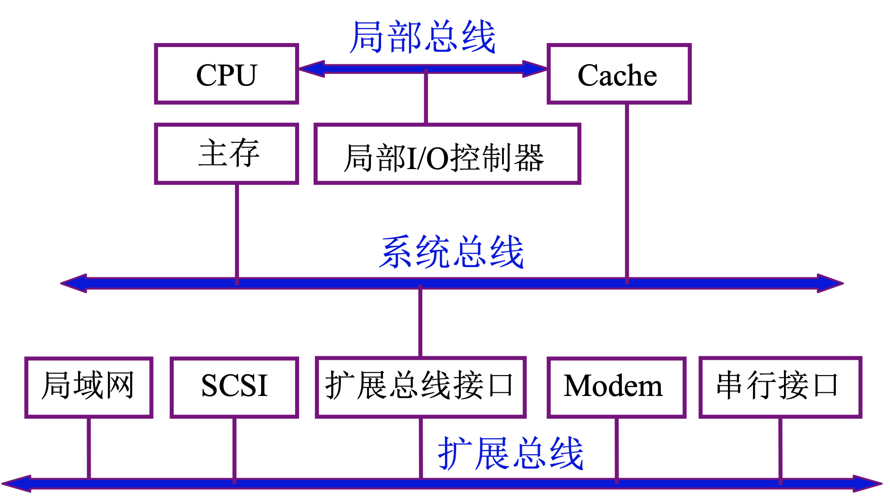
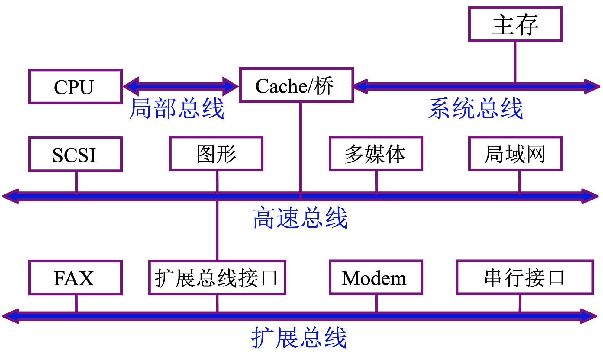

# 3.4 总线结构

### 单总线结构

所有设备连接到总线

⚠️问题：总线成为系统瓶颈

### 双总线结构

通道：有自己的控制器、有自己的指令系统、能够执行简单指令、执行通道程序

### 三总线结构

* 形式一

高速 I/O 设备通过 DMA 总线访问内存，低速设备依然使用 I/O 总线访问

* 形式二

局部总线：为了缓解 CPU 和主存速度差异过大的问题，加入 Cache，CPU 和 Cache 使用局部总线连接

局部 I/O 控制器：连接局部高速设备

扩展总线：连接各种 I/O 设备，通过扩展总线接口和系统总线连接

⚠️问题：多种速度类型设备都连接到扩展总线上，影响外部设备工作速度

### 四总线结构

局部总线：连接 CPU 和 Cache/桥

系统总线：连接 主存 和 Cache/桥

高速总线：高速设备连接到高速总线，高速总线连接到 Cache/桥 上

扩展总线：低速设备连接到扩展总线，扩展总线通过扩展总线接口连接到高速总线
