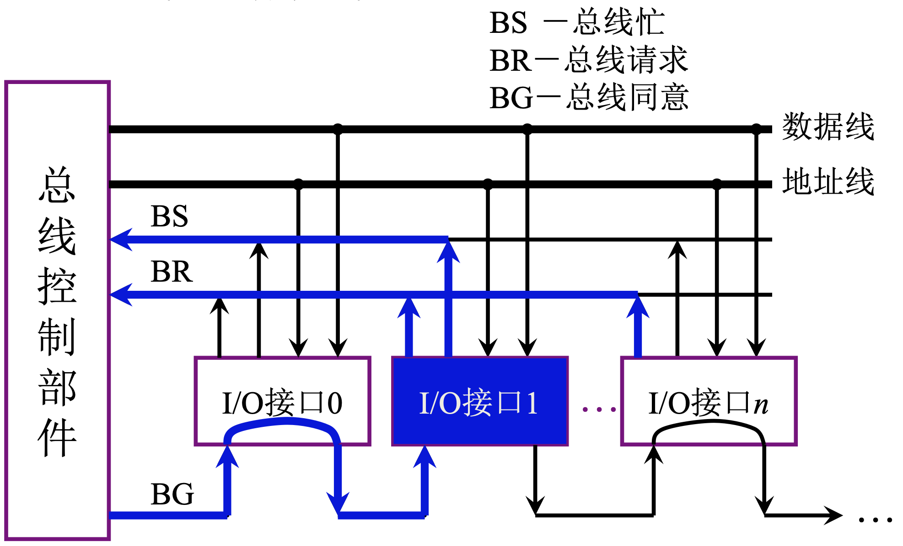
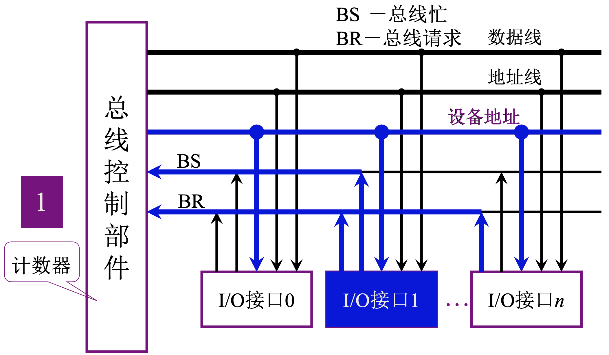
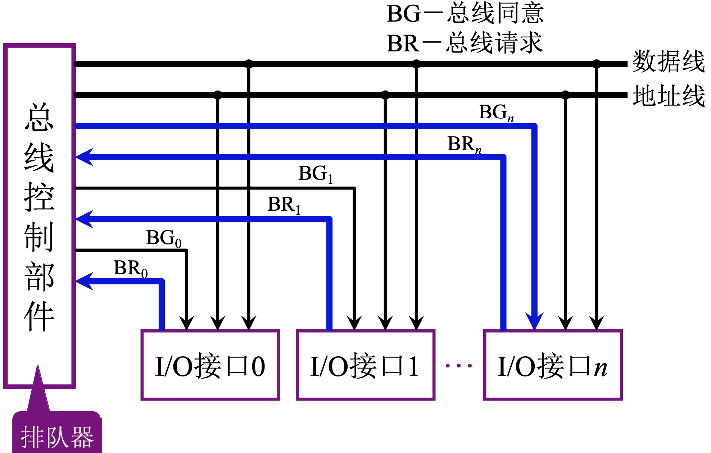

# 3.5 总线控制 - 判优控制

### 总线判优控制

* 根据**是否能提出总线请求**分类

主设备：对总线有控制权；可以提出总线占用请求，占用总线后可以控制和另外一台设备之间进行的通讯过程

从设备：响应从主设备发来的总线命令；不能提出总线占用请求，不能对总线进行控制

* 总线判优控制方法

集中式：判优逻辑放在一个部件上

分布式：判优逻辑分布到各个设备

### 集中式

* 分类

1. 链式查询方式
2. 计数器定时查询方式
3. 独立请求方式

* 术语

BR（总线请求）：Bus Request
BG（总线同意）：Bus Grant
BS（总线忙）：Bus State

* 

优先级确定：距离总线控制部件越近优先级越高

优点：结构简单

缺点：对电路故障敏感

* 

优点：优先级确定灵活

设备地址线：线根数和设备个数有关

* 
