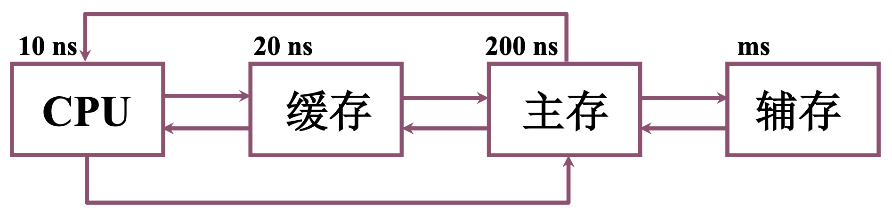

# 4.1 概述

### 分类

* 按存储介质分类

1. 半导体存储器：如内存、U 盘；易失（掉电信息丢失）

TTL（晶体管-晶体管逻辑门）：集成度低、功耗高、速度快

MOS（金属氧化物半导体）：功耗低、集成度高

2. 磁表面存储器：如磁盘、磁带；由磁头、磁载体组成

3. 磁芯存储器：硬磁材料、环状元件

4. 光盘存储器：激光、磁光材料

* 按存取方式分类

1. 存取时间与物理地址无关（随机访问）

随机存储器：在程序执行过程中可读可写

只读存储器：在程序执行过程中只读

2. 存取时间和物理地址有关（串行访问）

顺序存取存储器：如：磁带

直接存取存储器：如：磁盘

* 按作用分类

1. 主存储器

RAM：可读可写；分为静态 RAM 和 动态 RAM

ROM：只读；分为 MROM（掩膜式）、PROM（可编程）、EPROM（可擦写可编程）、EEPROM（电可擦写可编程）

2. Flash Memory

3. 高速缓冲存储器（Cache）

4. 辅助存储器：如磁盘、磁带、光盘

### 存储器的层次结构

缓存 - 主存 层次：解决速度问题（CPU 和 主存 速度不匹配）

主存 - 辅存 层次：解决容量问题
