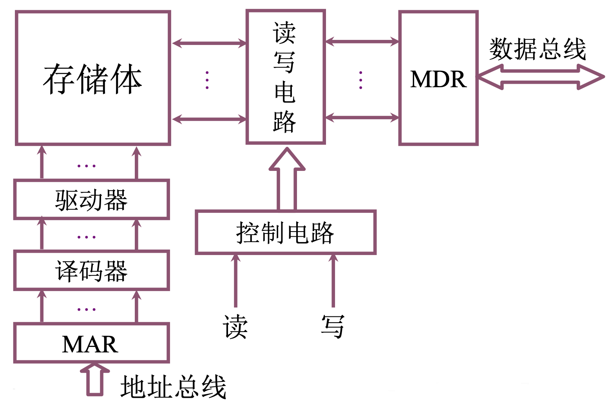
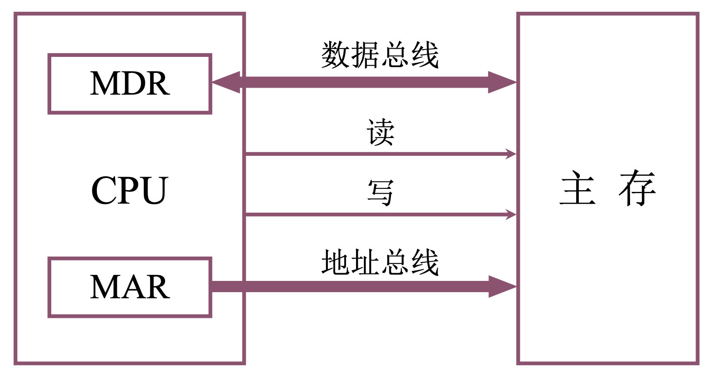
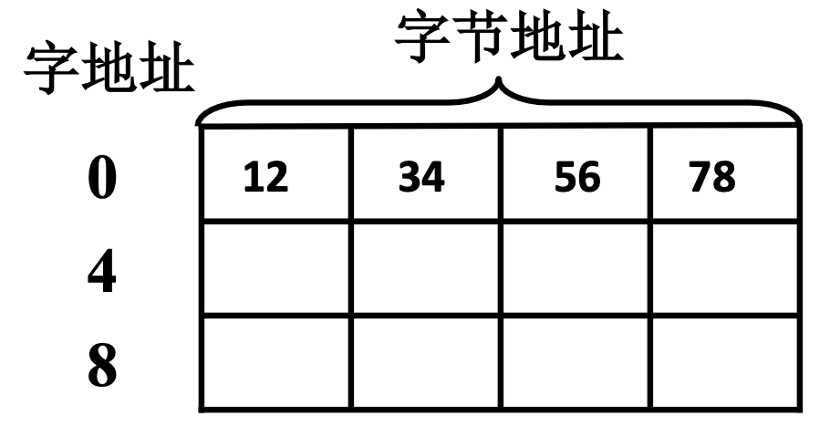
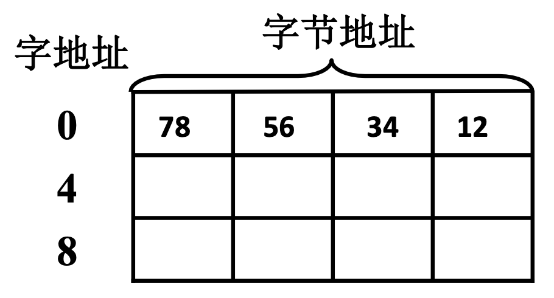

# 4.2 主存储器 - 概述

### 主存的基本组成

### 主存 与 CPU 之间的联系

### 主存中存储单元地址分配

例如存储 12345678H，共占用 32 位，需要 4 个字节

：高位字节存放在低地址，低位字节存放在高地址；高位字节地址为字地址

：高位字节存放在高地址，低位字节存放在低地址；低位字节地址为字地址

### 主存技术指标

* 存储容量

存放二进制代码的总位数

* 存储速度

存取时间：存储器的访问时间

存取周期：**连续**两次**独立**的存储器操作所需的**最小的时间间隔**

存储器带宽：位/秒
