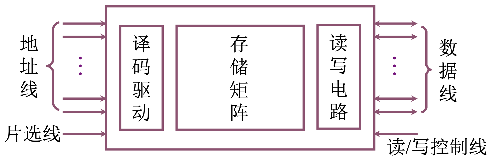

# 4.2 主存储器 - 半导体芯片简介

### 半导体存储芯片的基本结构

* 片选线：访问的信息在哪些芯片中

——
CS：芯片选择（chip select），上面**横线**，表示低电平有效，管脚是低电平，选择这个芯片

——
CE：芯片使能（chip enable）

* 读写控制线：对半导体芯片操作是读还是写

——
WE：写操作（write enable），上面**横线**，表示低电平时，对芯片进行写操作，高电平为读操作

——               ——
OE（out enable）& WE（write enable）：OE 为允许读操作，WE 为允许写操作

### 半导体存储芯片的译码驱动方式

* 什么是译码驱动方式

给出存储单元地址，如何去找到存储单元

* 线选法

缺点：不适合大型芯片

* 重合法
